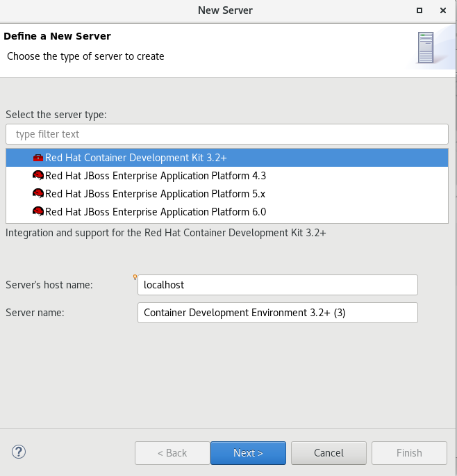
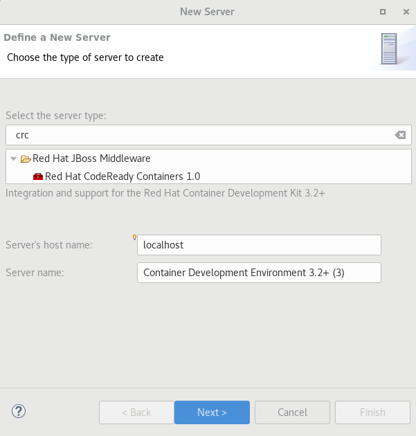
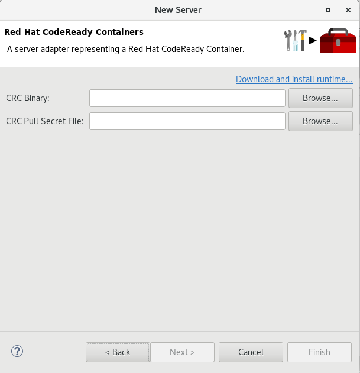
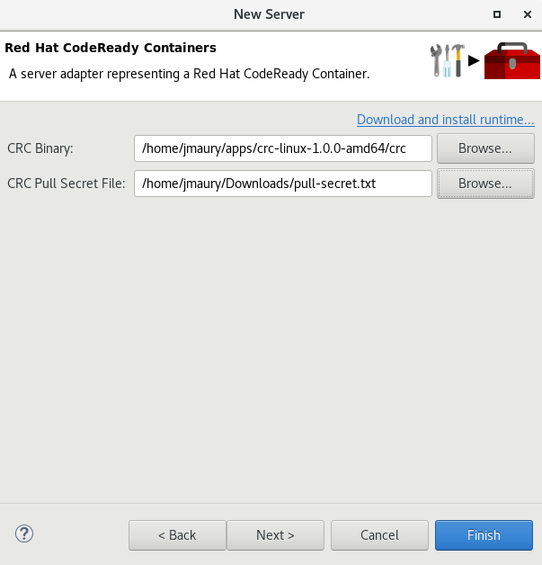
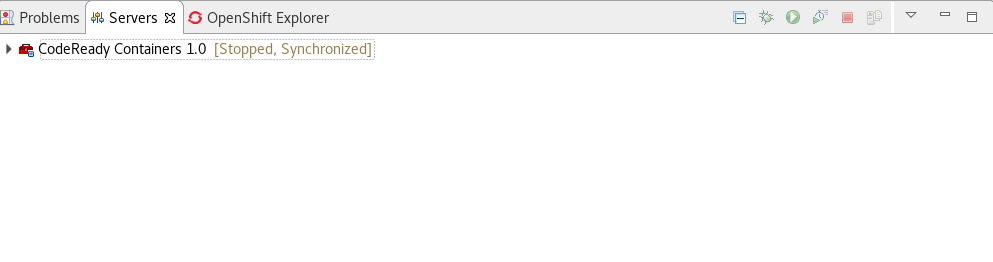
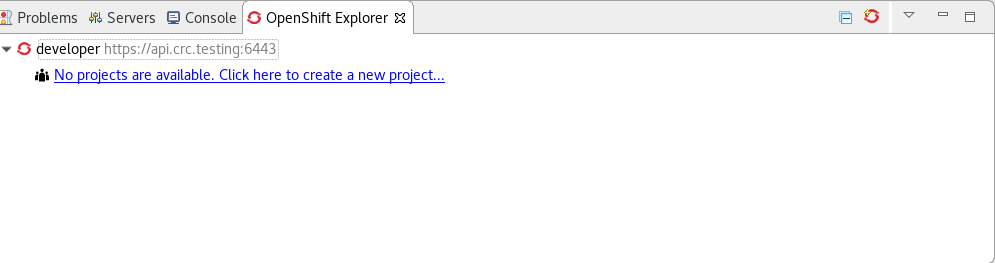

= OpenShift What's New in 3.8.0.Final
:page-layout: whatsnew
:page-component_id: openshift
:page-component_version: 4.13.0.Final
:page-product_id: jbt_core
:page-product_version: 4.13.0.Final
:page-include-previous: true

=== OpenShift Container Platform 4.2 support

With the new OpenShift Container Platform (OCP) 4.2 now available (see this 
https://www.redhat.com/en/about/press-releases/red-hat-expands-kubernetes-developer-experience-newest-version-red-hat-openshift-4[article,window=_blank]),
even if this is a major shift compared to OCP 3, JBoss Tools is compatible with
this major release in a transparent way. Just define your connection to your
OCP 4.2 based cluster as you did before for an OCP 3 cluster, and use the tooling !

=== CodeReady Containers 1.0 Server Adapter

A new server adapter has been added to support the next generation of CodeReady Containers 1.0.
While the server adapter itself has limited functionality, it is able to start and stop the CodeReady Containers virtual machine via its crc binary.
Simply hit Ctrl+3 (Cmd+3 on OSX) and type `new server`, that will bring up a command to setup a new server.

Enter `crc` in the filter textbox.

You should see the *Red Hat CodeReady Containers 1.0* server adapter.

Select *Red Hat CodeReady Containers 1.0* and click the *Next* button.

All you have to do is set the location of the CodeReady Containers crc binary file, the pull secret file location (the pull secret file can be downloaded from https://cloud.redhat.com/openshift/install/crc/installer-provisioned).

Once you’re finished, a new CodeReady Containers server adapter will then be created and visible in the Servers view.

Once the server is started, a new OpenShift connection should appear in the OpenShift
Explorer View, allowing the user to quickly create a new Openshift application and begin developing their AwesomeApp in a highly-replicatable environment.

related_jira::JBIDE-26824[]
related_jira::JBIDE-26871[]

