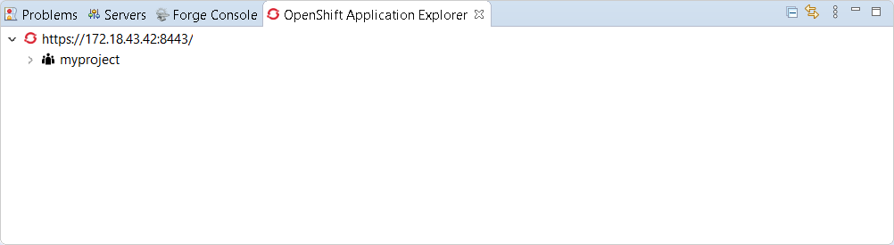
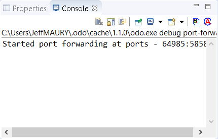

= OpenShift What's New in 3.9.0.Final
:page-layout: whatsnew
:page-component_id: openshift
:page-component_version: 4.14.0.Final
:page-product_id: jbt_core
:page-product_version: 4.14.0.Final
:page-include-previous: true

=== OpenShift Container Platform 4.3 support

With the new OpenShift Container Platform (OCP) 4.3 now available (see this 
https://blog.openshift.com/introducing-red-hat-openshift-4-3-to-enhance-kubernetes-security/[article,window=_blank]),
JBoss Tools is compatible with
this major release in a transparent way. Just define your connection to your
OCP 4.3 based cluster as you did before for an OCP 3 cluster, and use the tooling !

=== New OpenShift Application Explorer view

A new OpenShift Application Explorer window has been added in addition to the OpenShift Explorer. It is based on
https://github.com/openshift/odo/[OpenShift Do,,window=_blank]. It provides a different and simplified
user experience allowing easy and rapid feedback through 
inner loop and debugging.

Let's see it in action.

==== Opening the OpenShift Application Explorer view

If you opened a brand new workspace, you should see the
OpenShift Application Explorer view in the list of views
available on the botton part of the screen:


If you don't see the view being listed, you can open it
through the ```Window --> Show View --> Other``` menu,
enter ```open``` in the filter text box and then select
 ```OpenShift Application Explorer```:


Expanding the root node will display the list of projects
available on the cluster:



==== Java based micro service

We will show how to deploy a Java based microservice and
how to use the various features. But we first need to load
the component source code in our workspace. Thanks to the 
launcher wizard, we can do that easilly. Try ```Ctrl+N```
and select the ```Launcher project``` wizard:


Then click the ```Next``` button:

Select ```rest-http``` in the ```Mission``` field,
 ```vert.x community``` in the ```Runtime``` field,
 ```myservice``` in the ```Project name``` field:
 


Then click the ```Finish``` button: a new project will be
added to your workspace. Once the dependencies resolution
has been completed, we're ready to start playing with the
cluster.

===== Create the component

Now that we have the source code, we can create the component. From the OpenShift Application Explorer view,
right select the project (myproject), and the click the
 ```New -> Component``` menu:
 
image::./images/application-explorer6.png[width=600]

Enter ```myservice``` in the ```Name``` field, click the ```Browse``` button to select the project we have just created, select ```java``` in the
 ```Component type``` field, select ```8``` in the ```Component version``` field,
enter ```myapp``` in the ```Application``` field and uncheck the
 ```Push after create``` check-box:
 


Then click the ```Finish``` button. The component will be created and expanding
the project node will now show the application that contains our component:


Expanding the application will now display our component:


The component has been created but it is not yet deployed on the cluster (as we
unchecked the ```Push after create``` check-box. In order to deploy it,right
select the component and click the ```Push``` menu. The deployment will be
created and then a build will be launched. A new window will be created in the
 ```Console``` view. After a while, you should see the following output:
 


The component is now deployed to the cluster but we cannot access it as we need
to define an URL to access it externally. Right select the component and click
the ```New -> URL``` menu:


Enter ```url1``` in the ```Name``` field and select ```8080``` in the ```Port```
field:

image::./images/application-explorer12.png[width=600]

Then click on the ```Finish``` button. The URL is created but not on the cluster,
so we need to push again the component so that the local configuration is
synchronized with the configuration on the cluster. The ```Console``` window
will display a message claiming that a push is now required:


So push the component again (```component -> Push```).

Let's check that we can now access the service. Expand the component level so
that we can see the URL we have just created:


Right select the URL and click the ```Open in Browser``` menu, you should see the new browser window:


You can test the service: enter ```demo``` in the text box and click the
 ```Invoke``` button:
 


===== Feedback loop

We will now see how we can get fast feedback on code changes. So let's modify the
application code and see how we can synchronize the changes to the cluster.

In the ```Project Explorer``` view, locate the ```HttpApplication.java``` file:


Double click on the file to open the editor:


On line 14, change the line:

```java
  protected static final String template = "Hello, %s!";
```

to

```java
  protected static final String template = "Hello, %s!, we modified the code";
```
and press the ```Ctrl+S``` key in order to save the file.

For the OpenShift Application Explorer, right click the component (myservice) and
click the ```Push``` menu to send the changes to the cluster: the component will be
built again on the cluster with the next changes and after a few seconds, it will be
available again:


Select the browser window again, enter ```demo1``` in the textbox (we need to change
the value we used before in order to make sure cache is not involved) and click the
 ```Invoke``` button again:

image::./images/application-explorer20.png[width=600]

We've seen that, through a sequence of code modification(s) followed by a synchronize
action (push) to the cluster, we can get a very fast feedback. If you don't want to
manually synchronize the the cluster (push), you can opt to automatically synchronize
to the cluster with the ```Watch``` action: each time a code modification is done locally
on your workstation, a new build will be automatically launched on the cluster.

===== Going further: debug your application on the cluster

Testing an application through code changes is a great achievement so far but it
may be difficult for complex applications where we need to understand how the code behaves
without the need to use the UI. That's why the next step is to be able to debug our application live on the cluster.

The new OpenShift Application Explorer allow such a scenario. We will first set up a breakpoint
in our application code. Select again the ```HttpApplication.java``` file and scroll
down to the ```greeting``` method:


On line 41, double click in the left ruler column so that a breakpoint is set:


We are now ready to debug our application. In order to do that, we need to launch
a local (Java in our case) debugger that will be connected to our application on the
cluster. This is what the ```Debug``` action is doing: right select the component
(myservice) and click the ```Debug``` menu: you will see that port forwarding has been
started so that our local (Java) debugger can connect to the remote Java virtual
machine:



and then a local (Java) debugger is launched and connected to that port. Let's check now that we can debug our application:

Select the browser window again, enter ```demo2``` in the textbox (we need to change
the value we used before in order to make sure cache is not involved) and click the
 ```Invoke``` button again: as our breakpoint is hit, you will be asked if you want to
switch to the ```Debug``` perspective (this may not be displayed if you previously
selected the ```Remember my decision``` checkbox:


Click the ```Switch``` button and you will see the ```Debug``` perspective:


You are now debugging a Java component running on a remote cluster just like it was
running locally on your workstation. Please note that we demoed this feature using
a Java based component but we also support the same feature to NodeJS based components.


related_jira::JBIDE-27010[]
related_jira::JBIDE-27016[]


