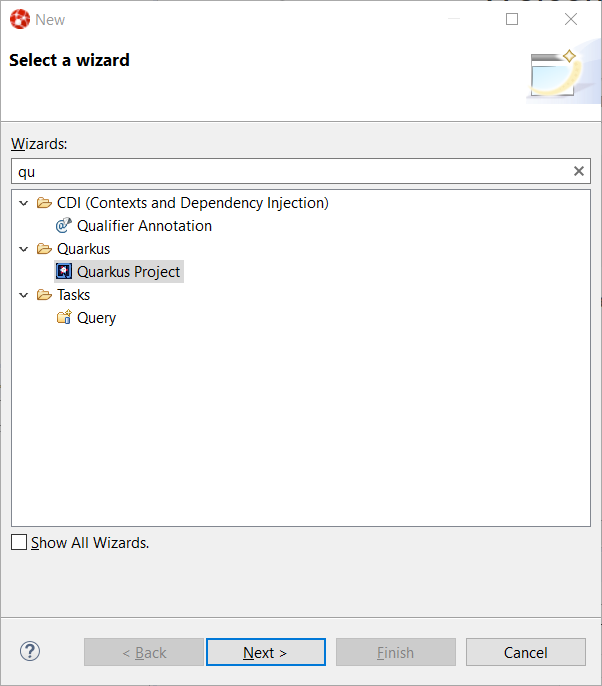

= Quarkus What's New in 4.14.0.Final
:page-layout: whatsnew
:page-component_id: quarkus
:page-component_version: 4.14.0.Final
:page-product_id: jbt_core
:page-product_version: 4.14.0.Final
:page-include-previous: false

=== Quarkus Tools added to JBoss Tools

A new component has been added to JBoss Tools. Quarkus Tools. It aims at providing tools
for Quarkus applications developers. The initial set of features is:

- Wizard for creating Quarkus projects based on https://code.quarkus.io[code.quarkus.io]
- Code completion and syntax validation on *application.properties*
- Launching your Quarkus application in Run/Debug mode

==== Quarkus project creation wizard

A new wizard has been added to create a new Quarkus application project in your workspace.
In order to launch it, first enter Ctrl+N to get the list of available wizards


In the filter text box, enter the ```qu``` characters to filter the list of wizards:



Select the *Quarkus Project* wizard and click the *Next* button:


The *Project type* combo allows you to choose between Maven or Gradle tool used to
manage your project. We'll go with Maven for this tutorial.

Enter a project name (we will use code-with-quarkus) and click the *Next* button:


This dialog allows you to choose various parameters for you project, like the project
coordinates (group id, artifact id and version) along with the base REST endpoint information.
We'll use the default so click on the *Next* button:


This dialog allows to select which Quarkus extensions you want to add to your project.
The extensions are grouped by categories, so first select a specific category in
the left table. We will choose the *Web* one:


You should have noticed that the middle table has been updated. In order to add an extension,
double click on the extension in the middle table. We will add *RESTEasy JAX-RS* and
*RESTEasy Qute* (a templating engine):

image::images/quarkus7-1.png[]

You should have noticed that the extensions that you double clicked on are now being added
to the right table. If you want to remove an extension from the list of selected ones,
double click again either in the center table or in the right table.

We are now all set so click on the *Finish* button to launch the project creation.
The project creation job is then launched, dependencies are being retrieved and
after a while, the new project will appear in the *Project Explorer* window:


We have successfully created our first Quarkus project. Let's see now how we can launch this application and debug it.

==== Running the Quarkus application

Running a Quarkus application can be done from the workbench Run configurations.
Select the *Run -> Run Configurations...* menu to display the dialog allowing to create a Run configuration.


Scrool down until the *Quarkus Application* is visible and select it:


Click on the *New configuration* button (top left):


A workspace project needs to be associated with the configuration so click on the *Browse*
button to see the project selection dialog:

image::images/quarkus12-1.png[]

As the workspace contains a single project, it is automatically selected and we can click
on the *OK* button:


The configuration is not ready to be used. So let's start our Quarkus application by clicking
on the *Run* button:

You should see a new Console being displayed.


The application is being built and after a while, it will be started:


==== Debugging the Quarkus application

Debugging a Quarkus application is just a simple as launching the previous configuration
we've just created in Debug.
You just need to open the **Run -> Debug Configurations...**. menu and click on the *Debug* button.

It will start the Quarkus application like in the previous paragraph but also connect
a remote JVM debug configuration to your running Quarkus application. So if you have set breakpoints
in your application source files, the execution will automatically stops there.

==== application.properties content assist

Every Quarkus application is configured through a configuration called
**application.properties**.

The content of this configuration file is dependent of the set of Quarkus
extensions that your application is using. Some settings are mandatory, some others
are not and the possible values are specific to the nature of the setting:
boolean, integer, limited set of values (enumerations).

So, as a developer, you need to look at various guides and documentations
(the core Quarkus and the extension specific ones)

So Quarkus Tools provides content assist on those specific files that:

- validates the content of the application.properties files
- provides you with the possible setting names and values

Let's see it in action.

Go to *src/main/resources/application.properties* in the project and right click and select **Open With -> Generic Text Editor**:


Go the third line of the file and invoke code completion (Ctrl + Space):


For each setting, a documentation is displayed when you mouse over the setting.
Let try to add **quarkus.http.port** to the file and mouse over this name:


If we enter a wrong value (false instead of a numeric value), then the error will be highlighted:


This is the first set of features that will be integration into the next version
of JBoss Tools. We encourage you to used it and if you are missing features and/or enhancements, don't hesitate to report them here: https://issues.redhat.com/issues/?jql=project%20%3D%20JBIDE%20AND%20component%20%3D%20quarkus%20and%20status%20!%3D%20Closed%20and%20status%20!%3D%20Resolved%20[JBoss Tools issue tracker]

related_jira::JBIDE-26978[]


