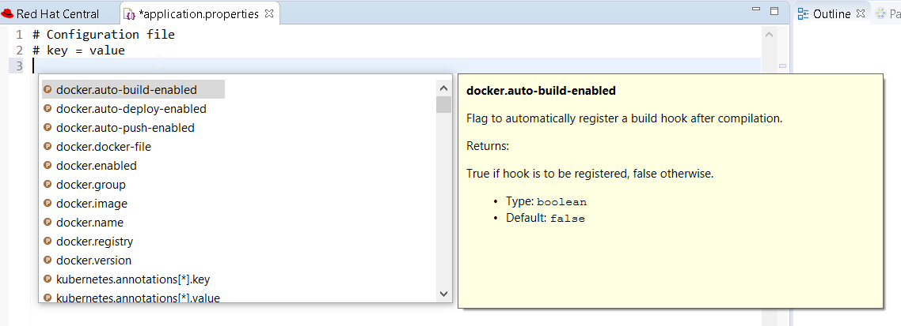
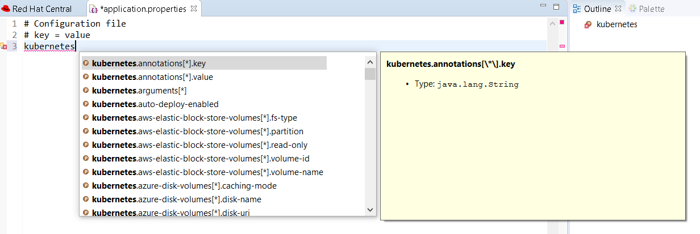
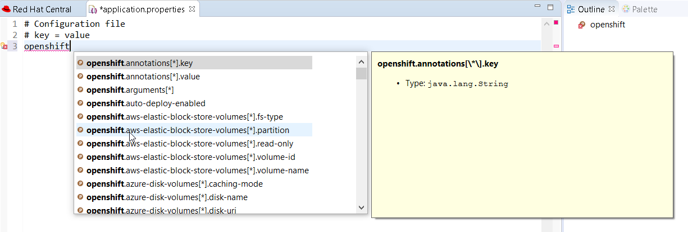
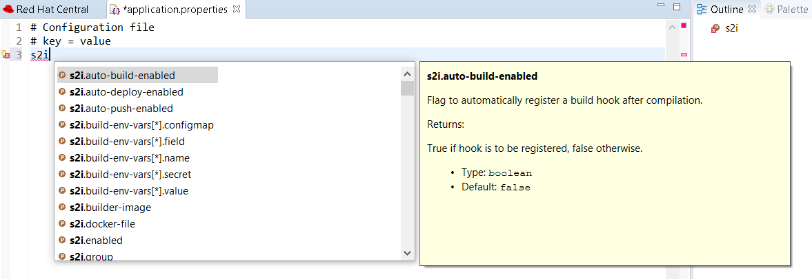
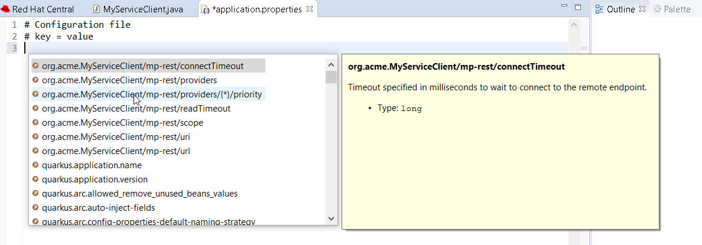
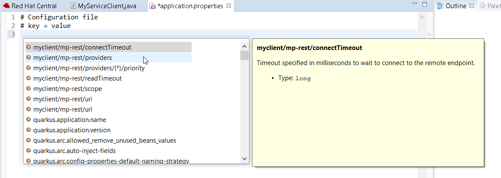
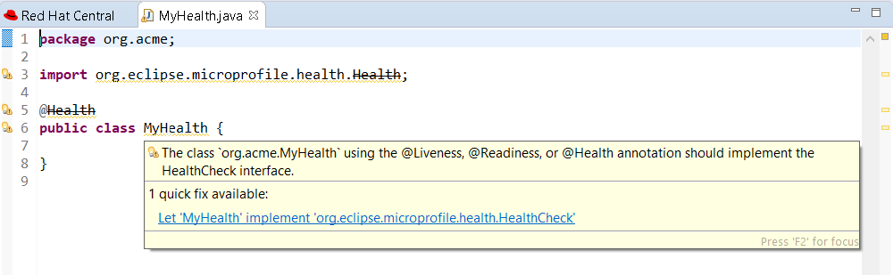
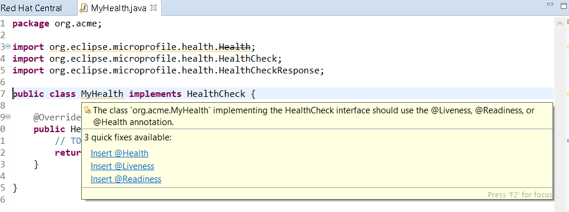

= Quarkus What's New in 4.15.0.AM1
:page-layout: whatsnew
:page-component_id: quarkus
:page-component_version: 4.15.0.AM1
:page-product_id: jbt_core
:page-product_version: 4.15.0.AM1

== Language support for Kubernetes, Openshift, S2i and Docker properties

There is now completion, hover, documentation and validation for kubernetes.*,
openshift.*, s2i.*, docker.* properties

Enter `kubernetes` prefix:

Enter `openshift` prefix:

Enter `s2i` prefix:

== Language support for MicroProfile REST Client properties

Likewise, there is now completion, hover, documentation and validation for the
MicroProfile properties from REST Client.

After registering a REST client using `@RegisterRestClient` like so:
[source,java]
----
package org.acme;

import javax.ws.rs.GET;
import javax.ws.rs.Path;
import javax.ws.rs.core.Response;

import org.eclipse.microprofile.rest.client.inject.RegisterRestClient;

@RegisterRestClient
public interface MyServiceClient {
	@GET
    @Path("/greet")
    Response greet();
}
----

The related MicroProfile Rest config properties will have language feature support
(completion, hover, validation, etc.).

Change the Java code so that the configuration key is changed:
[source,java]
----
package org.acme;

import javax.ws.rs.GET;
import javax.ws.rs.Path;
import javax.ws.rs.core.Response;

import org.eclipse.microprofile.rest.client.inject.RegisterRestClient;

@RegisterRestClient(configKey = "myclient")
public interface MyServiceClient {
	@GET
    @Path("/greet")
    Response greet();
}
----

and notice the code assist is changed accordingly:

== Language support for MicroProfile Health

Likewise, there is now completion, hover, documentation and validation for the
MicroProfile Health artifacts.

So if you have the following Health class:

[source,java]
----
package org.acme;

import org.eclipse.microprofile.health.Health;

@Health
public class MyHealth {

}
----

you will get a validation error (as the class does not implement the `HealthCheck`
interface:

Similarely, if you have a class that implements `HealthCheck` but is not annotated with `Health`, some workflow applies:

[source,java]
----
package org.acme;

import org.eclipse.microprofile.health.HealthCheck;
import org.eclipse.microprofile.health.HealthCheckResponse;

public class MyHealth implements HealthCheck {

	@Override
	public HealthCheckResponse call() {
		// TODO Auto-generated method stub
		return null;
	}

}
----

you will get a validation error (as the class is not annotated with `Health`
interface:

As there are several ways to fix the problem, then several quick fixes are proposed.
