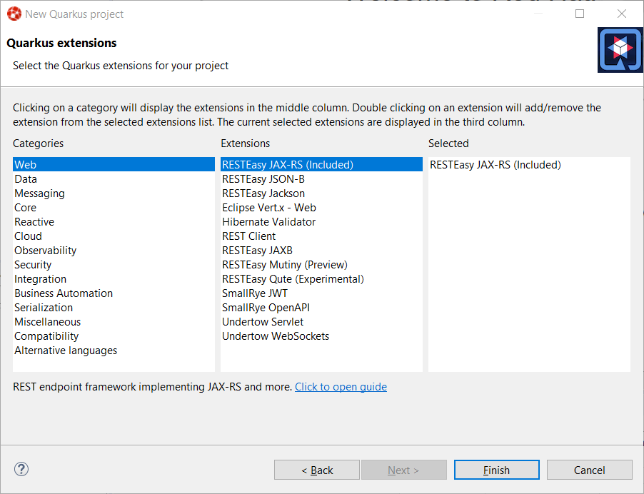
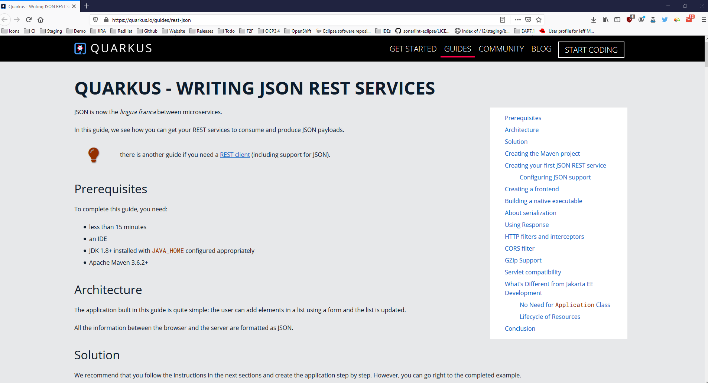

= Quarkus What's New in 4.15.0.Final
:page-layout: whatsnew
:page-component_id: quarkus
:page-component_version: 4.15.0.Final
:page-product_id: jbt_core
:page-product_version: 4.15.0.Final
:page-include-previous: true

== Better extensions reporting in the Quarkus project wizard

With the Quarkus extensions ecosystem growing, we improved information about extensions
in the Quarkus project wizard.

When you select an extension in the wizard, you will see the extension description in the
lower side of the wizard. If the extension has a guide on the Quarkus web site, a link
will also be displayed and clicking on that link will open the guide on your local web
browser.

