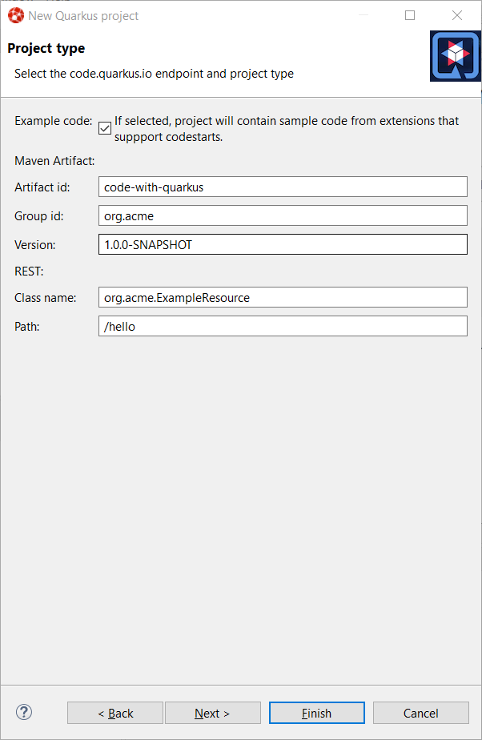

= Quarkus What's New in 4.18.0.AM1
:page-layout: whatsnew
:page-component_id: quarkus
:page-component_version: 4.18.0.AM1
:page-product_id: jbt_core
:page-product_version: 4.18.0.AM1

== Support for codestarts in New Quarkus project wizard

code.quarkus.io has added a new option codestart that allows extension that support
this new feature to contribute sample code in the generated project. It is enabled
by default and is accessible from the second step in the wizard:

