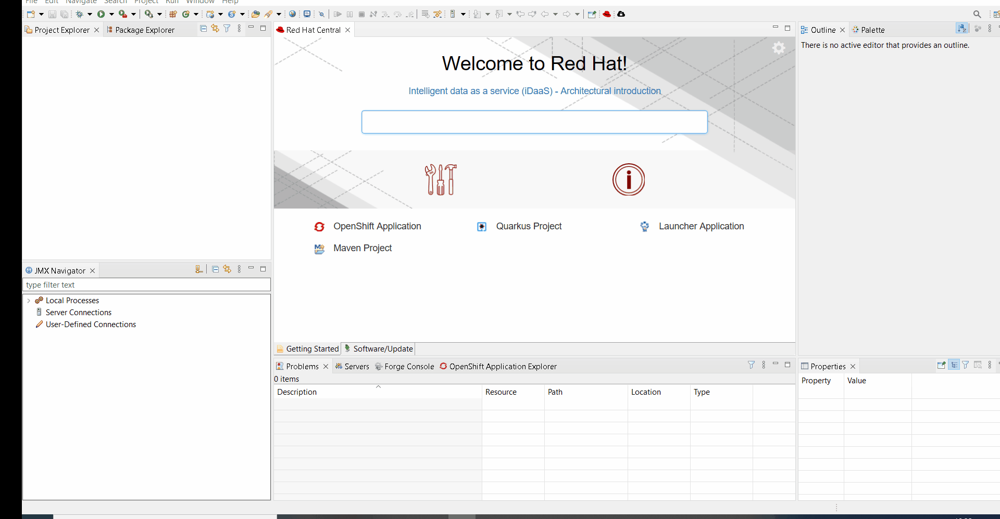
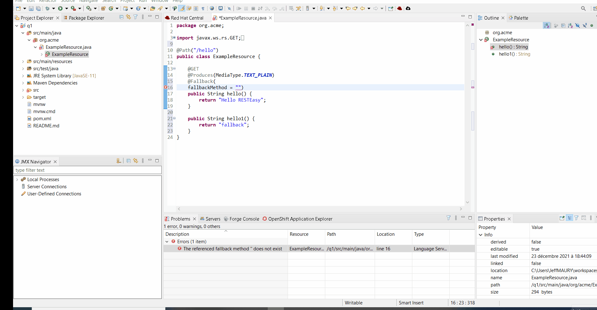

= Quarkus What's New in 4.21.2.AM1
:page-layout: whatsnew
:page-component_id: quarkus
:page-component_version: 4.21.2.AM1
:page-product_id: jbt_core
:page-product_version: 4.21.2.AM1

== Quarkus stream selection in the new Quarkus project wizard

When a new Quarkus project/module is to be generated, it is now possible to select the Quarkus stream (see https://quarkus.io/blog/quarkus-2x-platform-quarkiverse-registry/[this article]) on which the generated application will be based on.

By default, the recommended (latest release) will be selected but you can choose another one:

related_jira::JBIDE-27973[]

== Enhanced code completion in Java files

When you want to define a fallback method thanks to the `@Fallback` annotation from MicroProfile Fault Tolerance, the code completion is activated on the `fallbackMethod` member and will propose you available target methods.

related_jira::JBIDE-28052[]

== Quarkus launch configuration workspace resolution

When you define a Quarkus launch/debug configuration, it is linked to a specific project from your workspace. If this project has a dependency on another project from the workspace, it will be resolved against the workspace and you don't have to install the dependency in the local Maven/Gradle cache so that it can be resolved.

related_jira::JBIDE-28153[]

