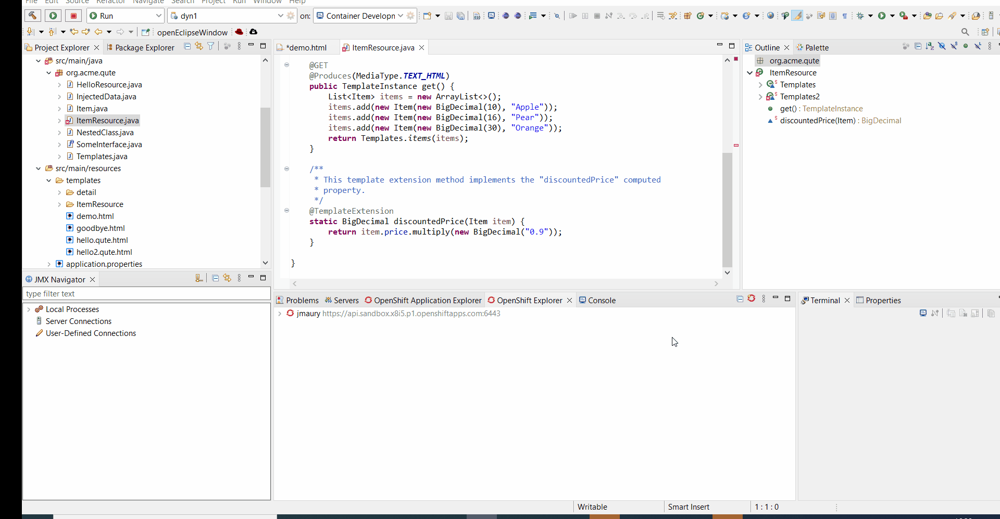

= Quarkus What's New in 4.23.0.Final
:page-layout: whatsnew
:page-component_id: quarkus
:page-component_version: 4.23.0.Final
:page-product_id: jbt_core
:page-product_version: 4.23.0.Final

== Qute templates support

Qute templates support has been added. This allows Quarkus developers to get enhanced editing experience to Qute templates located in their projects.

A Qute template is any file located under `src/main/resources/templates`  and with the `html`, `yaml`, `yml`, `json` or `txt` extension.

Qute support is enabled on any project that has a dependency on the Qute library.

You can generate a Qute enabled project with the Quarkus project wizard and choosing the RESTEasy Classic Qute extension

== Qute features

Features included into the Qute support are:

- Integration between Java files and Qute templates files
- Method parameter support in Qute template files
- Java Type Hover Support for Qute Templates
- Linked Editing Range Support in Qute Templates
- Qute Section Completion
- Support for Qute Validation
- Completion for Qute Value Resolvers
- Support for @TemplateExtension Methods
- Support for Directly Injecting Beans into Qute Templates

== Integration between Java files and Qute templates files

Any reference to a Qute template file from a Java file show the option to generate the Qute template file (if the Qute template file has not been found in the project) or navigate to the Qute template file.

== Method parameter support in Qute template files

The Qute language server has support for built-in and user-defined Java classes, including parameter completion and validation for their methods. Take advantage of this to easily avoid Java related mistakes.

== Java Type Hover Support for Qute Templates

When hovering over an expression in a Qute template, the Java type (built-in or user defined) will be displayed.

== Linked Editing Range Support in Qute Templates

Similar to most language, linked editing is now supported for Qute templates , allowing for simultaneous renaming of multiple parameter expressions.

== Qute Section Completion

Qute templates use sections in its templating language to power any logic required when compiling and displaying the resulting document. To support this, the extension’s Qute support populates a completion list with all available Qute sections, along with any parameters they take and a small code snippet of its usage.

== Support for Qute Validation

Java and Qute validation is included for Qute templates with Quarkus Tools, including diagnostics and quick fix suggestions.

The developer has the ability to disable this validation in their settings through the `Window` -> `Preferences` -> `JBoss Tools` -> `Qute`.

The second table contains a list of Qute templates (as regular expressions) for which validation will be excluded.

If any of the available validation is disturbing your development, you can disable Qute validation for the file project with a single click, using a “Quick Fix” that appears on every Qute related diagnostic

== Completion for Qute Value Resolvers

Paired with corresponding Java methods, built-in Java classes also have built-in Qute value resolvers made available by the Qute templating engine that is evaluated and outputs, or resolves to, a value. Quarkus Tools supports completion, hover and snippet generation for these built-in value resolvers.

image::images/quarkus42.gif[]

== Support for @TemplateExtension Methods

Template extension methods are used to extend the set of accessible properties of data objects. Qute support in Quarkus Tools has support for marked @TemplateExtension Java methods, which extend a given data model.

== Support for Directly Injecting Beans into Qute Templates

A CDI bean annotated with @Named can be referenced in any template through cdi and/or inject namespaces. Quarkus Tools provides completion and definition navigation support for Beans.

related_jira::JBIDE-28323[]