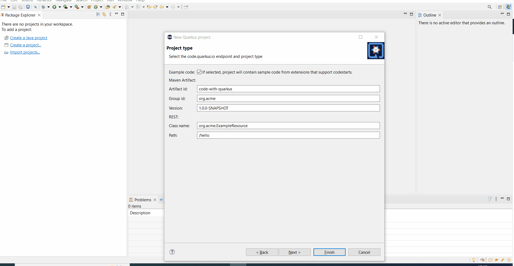

= Quarkus What's New in 4.24.0.AM1
:page-layout: whatsnew
:page-component_id: quarkus
:page-component_version: 4.24.0.AM1
:page-product_id: jbt_core
:page-product_version: 4.24.0.AM1

== Improvement to the new Quarkus project wizard

When the new Quarkus project wizard was initially design, there were a few Quarkus extensions so it was not difficult to find one from the
total list. Now that the Quarkus ecosystem is growing fast, it was difficult even of the extensions were grouped into categories.

In order to cope with this issue, the extensions and categories are now displayed in a tree (first level is categories, second level is
extensions).

This new tree can now be filtered through a text field. If user enter some characters, only extensions matching this filter will be displayed
in the tree.

related_jira::JBIDE-27448[]