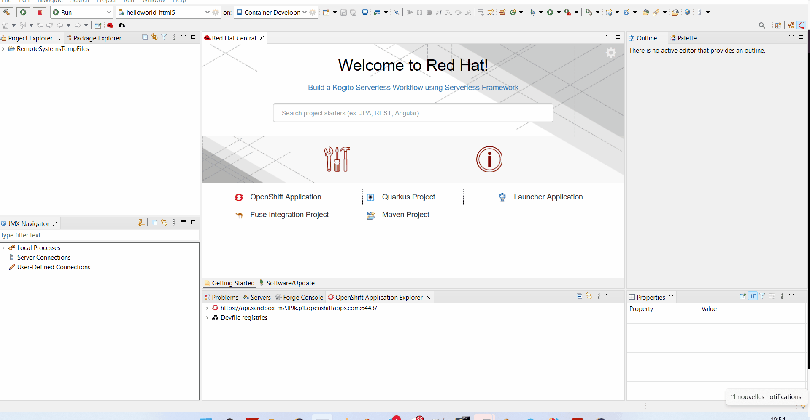

= Quarkus What's New in 4.25.0.AM1
:page-layout: whatsnew
:page-component_id: quarkus
:page-component_version: 4.25.0.AM1
:page-product_id: jbt_core
:page-product_version: 4.25.0.AM1

== Improvement to the new Quarkus project wizard

The Quarkus extension ecosystem is composed of extensions that are part of the platform and the others. The Quarkus project wizard has
been extended to allow exclusion of extensions that are not part of the platform.

related_jira::JBIDE-28449[]