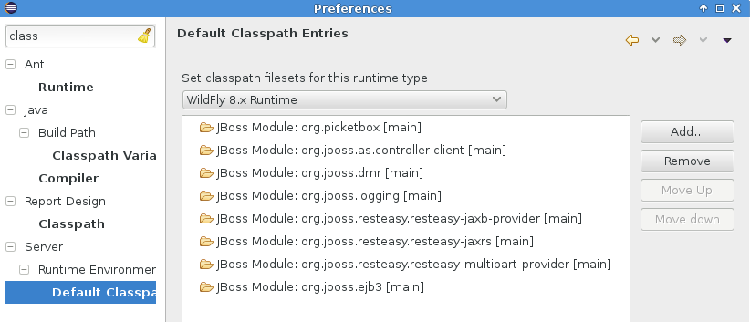
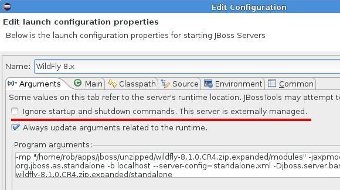
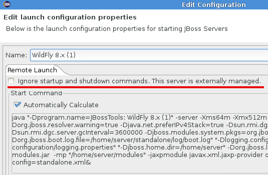
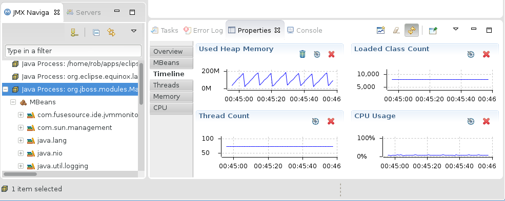

= Server What's New in 4.2.0.Beta2
:page-layout: whatsnew
:page-component_id: server
:page-component_version: 4.2.0.Beta2
:page-feature_jbt_only: true
:page-product_id: jbt_core 
:page-product_version: 4.2.0.Beta2

== JBoss Server Adapters

=== JBoss and Wildfly Runtime classpath containers now support searching by module!

Previously, JBoss and Wildfly runtimes in your eclipse workbench would provide classpath containers
that consisted of a set of jars found by filesets. If you wanted to update, change, or remove entries,
you'd need to customize the list of entries in a preference page, where your only options were to 
add or remove filesets with includes and excludes patterns. 

This "worked", but it really wasn't good enough. It became downright dangerous, though, once
the Wildfly servers gained a patching ability to upgrade servers. Finding the proper jar
was no longer as simple as using a fileset with an easily located base directory, but
instead became dependent upon the actual details of your installation. 

Now, that same preference page allows you to add a custom classpath entry for a JBoss module ID. 
The classpath containers will search all appropriate directories based on
the current state of the installation to locate the correct versions of the jars to be 
added to your eclipse project's classpath.

Users who already customized their list won't receive the new classpath resolution
by default. Instead, they'll need to browse to Window -> Preferences -> Server -> Runtime Environment -> Default Classpath Entries
and select "Restore Defaults".  

related_jira::JBIDE-9479[]

=== Classpath containers will also support jboss-modules dependencies!

Those same classpath containers mentioned above will also be able to customize the container results
if your project's manifest.mf includes a "Dependencies" attribute as specified by some of Wildfly's documentation.
You can read more about how this might work on the Application Server level here: https://docs.jboss.org/author/display/MODULES/Manifest+module+information

In general, this feature is most useful if your project is making use of the application server's 
lower level functionality, or if your deployment is intended as, or has dependencies on, a JBoss Module. 

related_jira::JBIDE-17236[]

=== Externally managed setting for servers moved to launch configuration

While previously the server editor had checkboxes for indicating that a server
was externally managed, and would be started or stopped manually by the user themself, 
it was decided that this setting fit much more naturally into the launch configuration
and its associated user interfaces. This setting has been moved, but your old settings 
should still work. 

related_jira::JBIDE-17076[]

== JMX enhanced with JVM Monitor

=== JVM Monitor

The MBean Explorer, currently renamed to the JMX Navigator, has an exciting new addition. 
After connecting to a given JMX Connection, the properties view will now fill up 
with an expansive UI for profiling many aspects of your running server. The functionality itself
is a fork of http://www.jvmmonitor.org/[JVM Monitor], and most of the documentation of that project still applies, though there are 
some changes. 

JVM Monitor is essentially a profiling agent, which will attach its library to your running
java application in order to capture profiling data. The profiling data is polled repeatedly, allowing
charts, call-trees, thread states, and many other utilities that you'll find useful in debugging 
all sorts of problems on your running server. 

Also, the JMX Navigator can automatically detect java processes running on your machine, and 
expose them for both JMX browsing and profiling. This profiling ability is available not just 
for servers but for all java launches, if you choose to make use of it. 

For Beta2, only the automatically detected processes will have this integration with the properties
view, but we expect to expand the integration efforts substantially in the upcoming releases. 

Most of the documentation for this expansive new functionality can be found at 
http://www.jvmmonitor.org/doc/index.html.  Be aware, though, that not all of the 
documentation applies currently. Most notable is the absence of a JVM Explorer
view. While no complete list of differences is available at the moment, we expect to make one available for our GA release.

related_jira::JBIDE-17309[]

