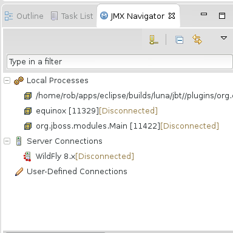
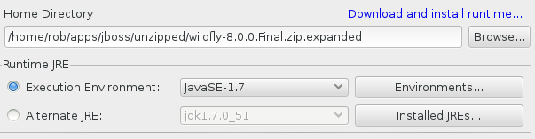
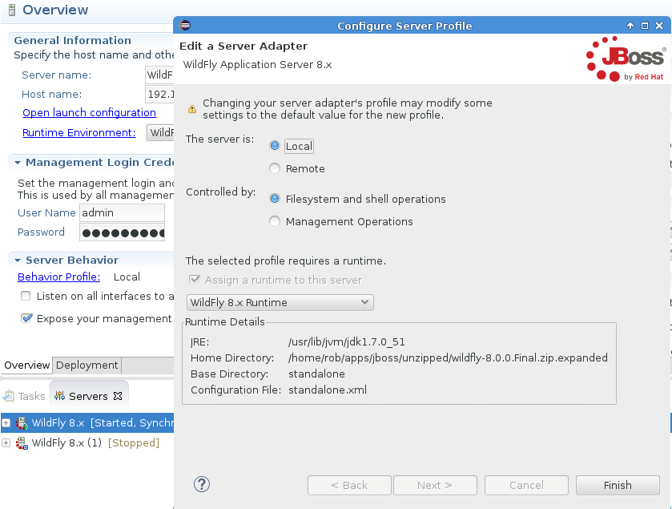

= Server What's New in 4.2.0.Beta3
:page-layout: whatsnew
:page-component_id: server
:page-component_version: 4.2.0.Beta3
:page-feature_jbt_only: true
:page-product_id: jbt_core 
:page-product_version: 4.2.0.Beta3

== JMX Support

=== Grouping of connections

The JMX Navigator now has three groupings: User-defined connections, Server connections, and Local Processes. This categorization makes it clearer where the connection comes from and when connections comes and go it does not disturb the overall ordering.

related_jira::JBIDE-17639[]

== JBoss Server Adapters

=== Servers and Execution Environments

Servers can now specify either an execution environment or specific JRE to be used for its launch. The list of available environments or JRE's are based on the server type.

related_jira::JBIDE-17646[]

=== Modifying server profile

Modifying a server profile often requires some changes to various settings. Without these changes, the resultant server adapter may be in a inconsistent state. For example, a remote server that does not expose its management port should not be using the management API to determine if the remote server has started successfully. 

Until Beta3 you could not change this via the UI, now you can. There is now a "Behavior Profile" hyperlink in the server editor to change the used profile via a wizard.

Once the wizard is complete, the server editor will save, close, and re-open to pickup the latest changes.

related_jira::JBIDE-17636[]

