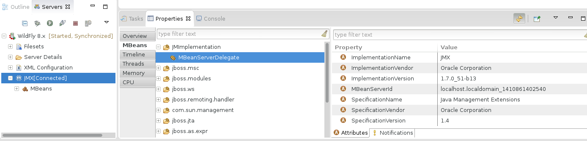
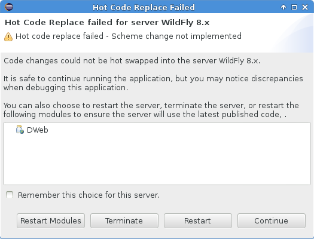
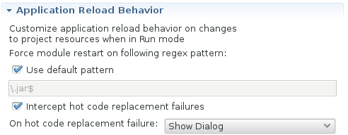

= Server What's New in 4.2.0.CR1
:page-layout: whatsnew
:page-component_id: server
:page-component_version: 4.2.0.CR1
:page-feature_jbt_only: true
:page-product_id: jbt_core 
:page-product_version: 4.2.0.CR1

== JMX Support

=== JVM Monitor UI available from Servers View

Previously, the JVM Monitor UI (visible in the properties view) was only available if your selection was in the JMX Navigator. The UI can now be activated by changing selections in the Servers View as well. 

related_jira::JBIDE-18064[]

== JBoss Server Adapters

=== Hot Code Replace ENHANCED!

In the past, deciding when to forcefully restart a module was a tough question, and often led to behavior that upset one group or another of our users. We think the most recent changes strike a great balance between the various usecases. 

When your server is run in debug mode, modules will not be restarted by default, and will also not match against the regular expression for restart behavior visible in the server editor. Instead, we will allow hot-code replace to take over the bulk of these changes. If the user wants, though, they can still full-publish their module manually to force a module restart. 

In the event that the hot-code replacement fails, due to either obsolete methods on the stack or a changing method signature, the users will now be presented with a dialog that allows them to terminate or restart the server, ignore the changes, or redeploy the modules.  

This setting can also be changed or reset in the Server Editor. 

We feel this change will really improve the user experience, and finally unifies the disparate use-cases into a more logical workflow that fits better with the Eclipse development experience. 

related_jira::JBIDE-18094[]

