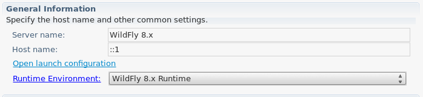
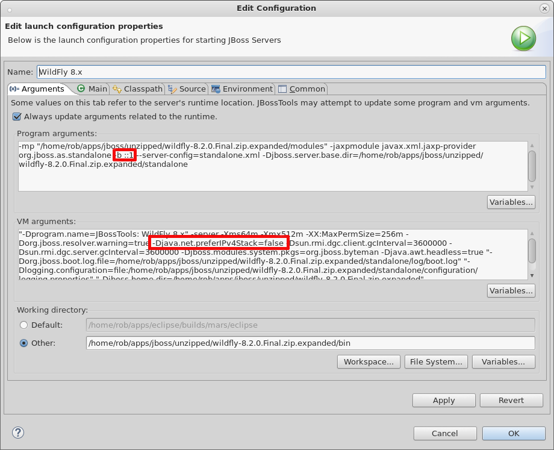

= Server What's New in 4.2.3.Beta1
:page-layout: whatsnew
:page-component_id: server
:page-component_version: 4.2.3.Beta1
:page-feature_jbt_only: true
:page-product_id: jbt_core 
:page-product_version: 4.2.3.Beta1

== IP6 Support Added

For JBoss 7 and Wildfly installations, using hostnames with an IPv6 format often failed to connect, show webpages, or even verify the server's state. Several changes have made this work as expected. With updated wildfly jars, management commands will execute without issue. In addition, our tools will now automatically recognize host names in an IPv6 pattern, and update your launch configuration's various launch arguments to ensure that the server starts properly and with all expected flags set. 

related_jira::JBIDE-19113[] - Update of wildfly jars
related_jira::JBIDE-12352[] - Remote Management Connections to Wildfly IPv6
related_jira::JBIDE-12351[] - JMX connections to Wildfly IPv6
related_jira::JBIDE-12282[] - Wildfly server fails to Stop IPv6

