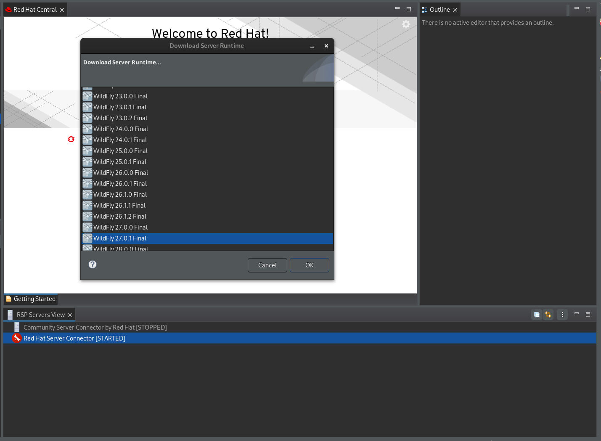

= Server What's New in 4.29.0.Final
:page-layout: whatsnew
:page-component_id: server
:page-component_version: 4.29.0.Final
:page-product_id: jbt_core
:page-product_version: 4.29.0.Final

== New Server view based on RSP

A new view using RSP (Remote Server Protocol) as been added in JBossTools, called "RSP Servers View".

First, the server connector used to handle the servers needs to be started. Right click on any Server connector entry, and select "Start RSP".

The server connector is now starting and it's status will change to [STARTED].

You can then choose between download a server or use a local server.

Let's create a new server. Right click on the started Server connector and select "Download Server". Select any runtime on the list and click OK.

Follow the dialog steps for additional parameters and  wait for the installation to finish. You can see a new entry on the server view with the selected server.

image::images/RSP_View_4.png[Wildfly server runtime installed]

Now start the server runtime using "Start Server" context menu action. The console view opens and display any message from the server.

Now you can add any deployment to the server. This can be either a folder or a file, present on your local computer. For example, let's deploy a basic web application.

Right click on the started server runtime and select "Add deployment". Then select a web archive to be added to the server.

image::images/RSP_View_6.png[Adding a simple web application to the runtime]

It will automatically deploy the application and display any message in the console.

Now you can enjoy the application on your browser !

We are welcoming any suggestion to this new view, either on our JIRA/Github, or using our https://matrix.to/#/#redhat-developer_server-connector:gitter.im[gitter chatroom]

