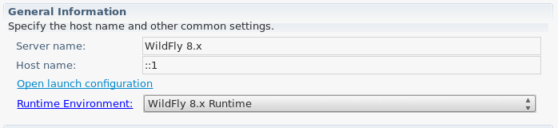

= Server What's New in 4.3.0.Alpha1
:page-layout: whatsnew
:page-component_id: server
:page-component_version: 4.3.0.Alpha1
:page-feature_jbt_only: true
:page-product_id: jbt_core 
:page-product_version: 4.3.0.Alpha1

== IP6 Support Added

For JBoss 7 and Wildfly installations, using hostnames with an IPv6 format often failed to connect, show webpages, or even verify the server's state. Several changes have made this work as expected. With updated wildfly jars, management commands will execute without issue. In addition, our tools will now automatically recognize host names in an IPv6 pattern, and update your launch configuration's various launch arguments to ensure that the server starts properly and with all expected flags set. 

image::images/ip6_launch_config.png[Launch Configuration for IPv6 Hosts]

related_jira::JBIDE-19113[] - Update of wildfly jars
related_jira::JBIDE-12352[] - Remote Management Connections to Wildfly IPv6
related_jira::JBIDE-12351[] - JMX connections to Wildfly IPv6
related_jira::JBIDE-12282[] - Wildfly server fails to Stop IPv6

== Project Archives, support for ant usecase removed

In previous releases, Project Archives was designed in such a way that the core plugin would be compiled into multiple jars, one of which had minimal dependencies on Eclipse, allowing it to be used from ant. This usecase was fairly complicated to get working for the user, and involved locating and adding several eclipse jars to the ant classpath, making use of a custom ant task, and adding a significant amount of configuration in your build.xml file to properly map details like a project's location. 

Despite attempting to be portable, persistable, and shareable, this usecase never really lived up to any of those goals. While the eclipse tooling could simply use a project name in its internal metadata, allowing the user to keep those projects wherever they want while using eclipse to resolve their location, the ant usecase required hard-coded location mappings for each project in the build.xml, limiting its usefulness in a shared environment. 

For this and several other reasons (including ant's decreasing utility, and our own internal policies for how plugins should be packaged), this 10-year old use case has been removed. 

