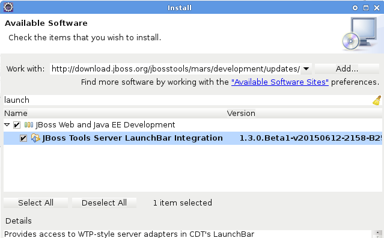

= Server What's New in 4.3.0.Beta1
:page-layout: whatsnew
:page-component_id: server
:page-component_version: 4.3.0.Beta1
:page-feature_jbt_only: true
:page-product_id: jbt_core 
:page-product_version: 4.3.0.Beta1

== Support for Port Monitoring

Support for Port Monitoring has been (finally) added to JBoss, WildFly, and our enterprise server adapters. With a preference page, a view for tracking recent past requests, integration with the servers view, and some custom enhancements of our own, JBoss Tools is confident that our integration with this WebTools feature is more complete than what's available with other server adapters. 

image::/blog/images/20150521-monitoring-view.png[]

A link:http://tools.jboss.org/blog/2015-05-28-port-monitoring.html[blog entry] has been posted with further details. 

related_jira::JBIDE-19755[Implement ServerPort portion of wst.servertools API]

== LaunchBar

A new feature hiding in the CDT repository of eclipse is being released with Mars. Called the LaunchBar, this feature aims to update the UI of eclipse to allow for more easy running of launch configurations (and other things). In this Beta1 release, we're adding this feature in an optional addition to our Server Tools. We've also written our own extensions to it, integrating the LaunchBar with WTP's Server Adapters. 

The list of launchable objects (center) is linked with your selections in the workspace when used with our extensions, in most cases before you've ever even launched the object. The list of targets (on the right) will include all existing server adapters compatible with the launchable. 

To enable this feature, you need to install from `Help > Install New Software... > http://download.jboss.org/jbosstools/mars/development/updates` then select the `JBoss Tools Server LaunchBar Integration` feature.

For more information, you can also check launchbar's link:https://wiki.eclipse.org/CDT/LaunchBar[documentation] at eclipse.org, or try it for yourself.

related_jira::JBIDE-19711[WTP servertools integration with CDT launchbar]
