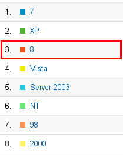

= Usage What's New in 4.1.0.Alpha1
:page-layout: whatsnew
:page-component_id: usage
:page-component_version: 4.1.0.Alpha1
:page-feature_jbt_only: true
:page-product_id: jbt_core 
:page-product_version: 4.1.0.Alpha1

== Reporting
=== Windows 8 	

Google Analytics was not reporting Windows 8 installations so far. People using Developer Studio/JBoss Tools on Windows 8 were displayed as using Windows NT. Google fixed this and Analytics are now reporting Windows 8 correctly:

related_jira::JBIDE-13270[]
