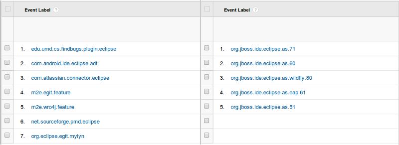

= Usage What's New in 4.2.0.Beta1
:page-layout: whatsnew
:page-component_id: usage
:page-component_version: 4.2.0.Beta1
:page-product_id: jbt_core 
:page-product_version: 4.2.0.Beta1

== Usage tracking for installs and server creation 

Usage reporting is now able to track individual events besides just pure startups.
In this beta we activated two kinds of event tracking.

- Installs from JBoos Tools Central
- New server creation

These we will use to learn more about how our users are using the tooling
and improve tooling going forward. 

All information which is going to be collected is reflected in Preferences for you to review:

image::images/4.2.0.Beta1/preferences.png[]

As always JBoss Tools will not send any information before a user have opted in, nor
is there any personal information sent.

related_jira::JBIDE-16800,JBIDE-16424[]

