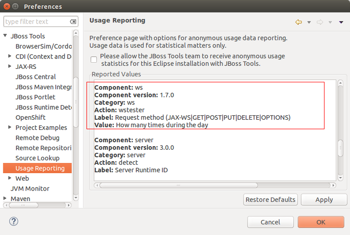

= Usage What's New in 4.2.0.CR1
:page-layout: whatsnew
:page-component_id: usage
:page-component_version: 4.2.0.CR1
:page-product_id: jbt_core 
:page-product_version: 4.2.0.CR1

== Usage tracking for Web Services Tester

A new usage event has been added to this release:
 

This will be used to learn more about how our users are using the tooling and improve it going forward. 

All information which is going to be collected is reflected in Preferences > JBoss Tools > Usage Reporting for you to review.

As always JBoss Tools will not send any information before a user have opted in, nor is there any personal information sent.

related_jira::JBIDE-17233[]