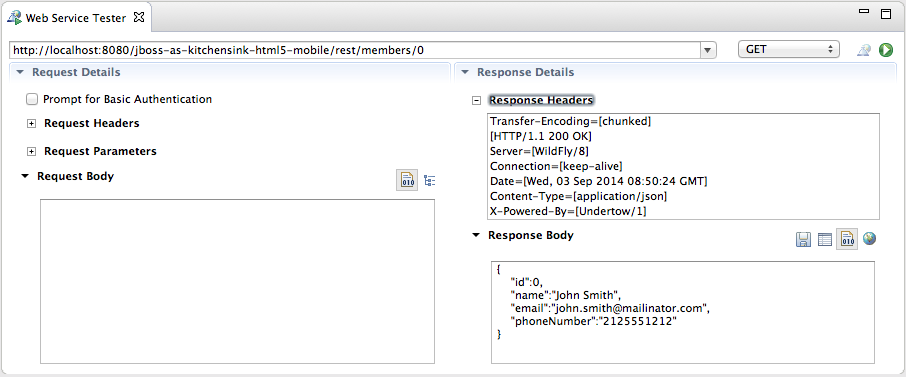

= Usage What's New in 4.2.0.CR1
:page-layout: whatsnew
:page-component_id: usage
:page-component_version: 4.2.0.CR1
:page-product_id: jbt_core 
:page-product_version: 4.2.0.CR1

== Web Services Tester Usage Tracking

The Web Services Tester is a view that helps users submit SOAP-style or plain HTTP requests on an endpoint to see how it responds.

From the "JAX-RS Web Services" node in the Project Explorer, users can select an endpoint and click on `Run As>Run on Server` or `Debug As>Debug on Server` to automatically deploy the project on an application server, have the view opened and submit a request. A dialog window will ask for values to set in the URI template if necessary.

As from JBoss Tools 4.2.0.CR1, we are starting to track usage for the Web Services Tester. In particular, we will collect the number of requests submitted with the WS Tester, per type of requests. This data will be aggregated by the Usage plugin and submitted once a day, on the following day, in order to keep the impact on the users'machines as low as possible.

Please remember that all the collected statistics are *anonymous* and that users can always choose to *NOT* send any data if they don't want to.
For more information about usage tracking, please read the link:/usage/index.html[documentation].

related_jira::JBIDE-17233[]

