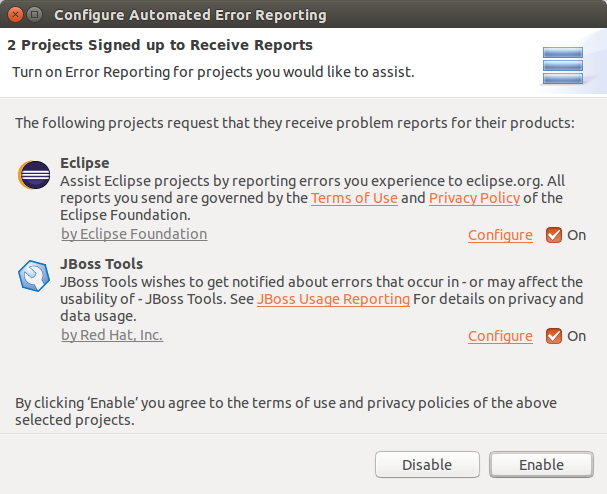

= Usage What's New in 4.3.1.Final
:page-layout: whatsnew
:page-component_id: usage
:page-component_version: 4.3.1.Final
:page-product_id: jbt_core
:page-product_version: 4.3.1.Final

== AERI Reporting

With your permission, Eclipse and Red Hat JBoss Developer Studio can inspect errors logged inside the IDE and inform project committers about the issues you've experienced. This optional service, called https://dev.eclipse.org/recommenders/community/confess/#/about[Automated Error Reporting Initiative (AERI)], can report issues to both the https://bugs.eclipse.org/bugs/[Eclipse Bugzilla] and the https://issues.jboss.org/browse/JBIDE[JBoss JIRA].

To configure the service, open `Preferences > General > Error Reporting`. You can then click `Configure Projects...` to enable or disable reporting to Eclipse or JBoss.

As always, neither Eclipse nor JBoss will use any information unless a user has opted in, nor is there ever any personal information sent unless it is provided on the Preferences page.

related_jira::JBIDE-21654[]
