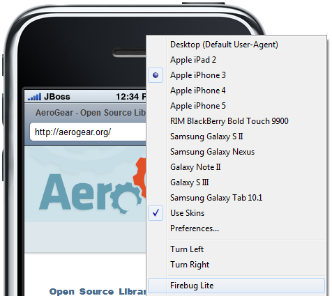
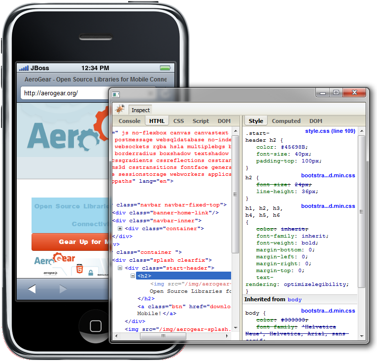

= Visual Editor What's New in 4.1.0.Alpha1
:page-layout: whatsnew
:page-component_id: vpe
:page-component_version: 4.1.0.Alpha1
:page-feature_jbt_only: true
:page-product_id: jbt_core 
:page-product_version: 4.1.0.Alpha1

== BrowserSim
=== Firebug Lite

Now you can inspect your page's source with FireBug Lite.

related_jira::JBIDE-13406[]