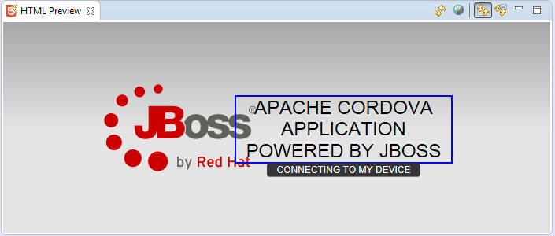
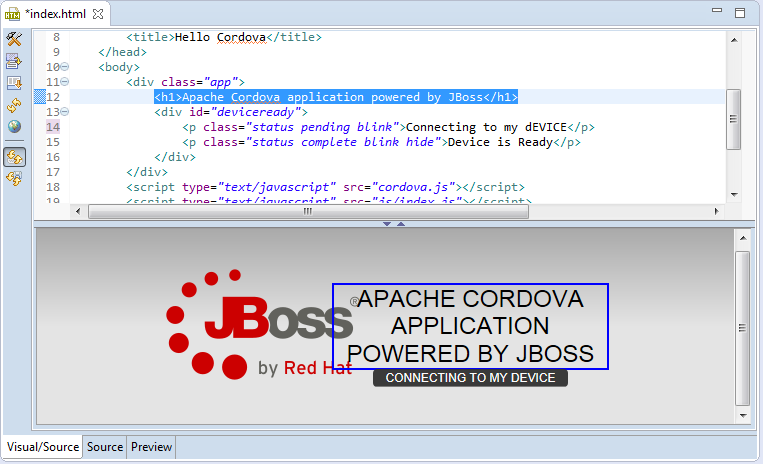

= Visual Editor What's New in 4.2.0.Beta2
:page-layout: whatsnew
:page-component_id: vpe
:page-component_version: 4.2.0.Beta2
:page-feature_jbt_only: true
:page-product_id: jbt_core 
:page-product_version: 4.2.0.Beta2

== HTML Preview as a separate plugin
HTML Preview is a WYSIWYG plugin for HTML pages. Preview is not coupled with a particular editor, but editor must have DOM model support. HTML Preview has several cool features like:

 -  automatic refresh (enabled by default)
 -  refresh on save
 -  navigation from source to view and vice versa

HTML Preview can be enabled via *Quick Access > HTML Preview*. More info about HTML Preview can be found in our http://tools.jboss.org/blog/2014-04-24-html-preview-is-taking-shape.html[blog].

related_jira::JBIDE-16908,JBIDE-16919,JBIDE-16920[]

== HTML Preview as a part of VPE

HTML Preview could also be treated as a possible XULRunner substitution for plain HTML pages (JSF/xhtml still requires XULRunner). The point is that, when XULRunner is unavailable, HTML Preview will be used in "Visual/Source" and "Preview" tabs of the https://github.com/jbosstools/jbosstools-vpe[VPE]. 

related_jira::JBIDE-16414,JBIDE-16925,JBIDE-16926,JBIDE-16927[]