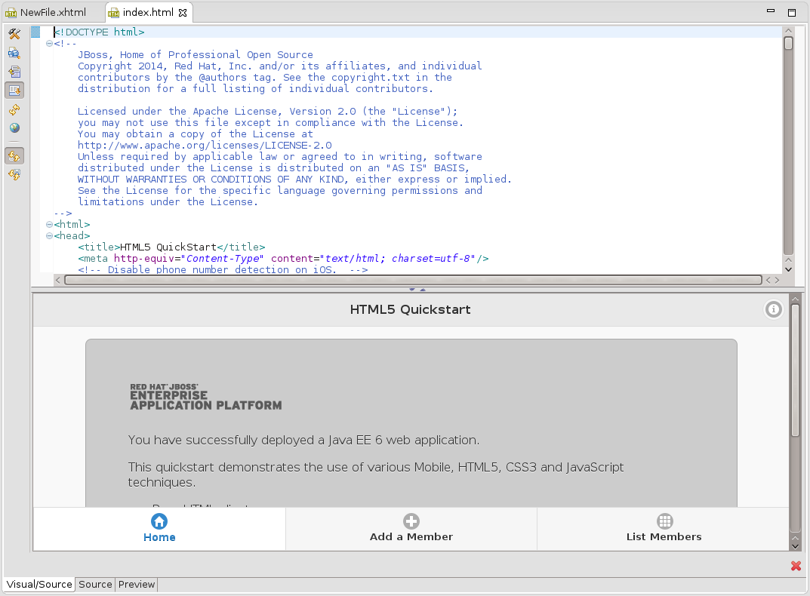
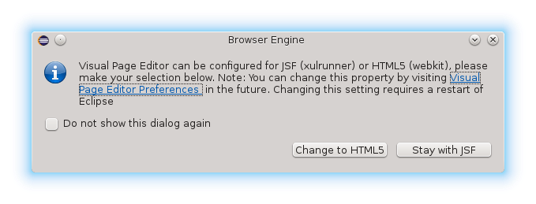

= Visual Editor What's New in 4.3.0.Alpha1
:page-layout: whatsnew
:page-component_id: vpe
:page-component_version: 4.3.0.Alpha1
:page-feature_jbt_only: true
:page-product_id: jbt_core 
:page-product_version: 4.3.0.Alpha1

== Multiple Browser Engine support on Linux

On Linux Visual Page Editor can be opened in HTML5 mode for HTML files, where all HTML5 features is supported.

Visual Page editor mode can be changed with dialog, which appears during HTML file openeng or in Visual Page Editor Preferences. using Changing Visual Editor mode requires Eclipse restart.

related_jira::JBIDE-18177[]
