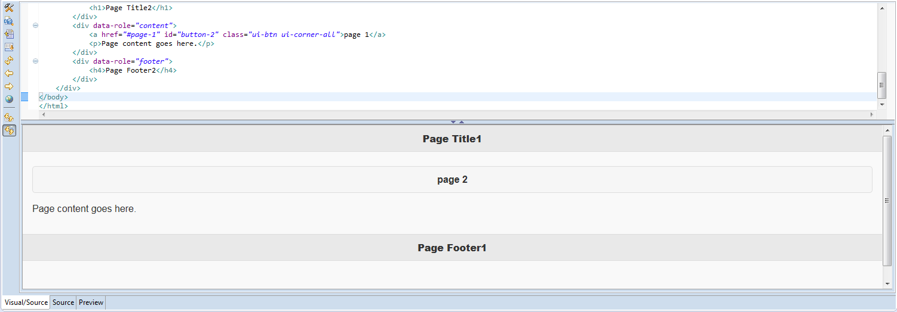

= Visual Editor What's New in 4.3.0.Beta2
:page-layout: whatsnew
:page-component_id: vpe
:page-component_version: 4.3.0.Beta2
:page-feature_jbt_only: true
:page-product_id: jbt_core
:page-product_version: 4.3.0.Beta2

== Navigation between pages on single-page application

For single-page applications, the Visual Editor supports navigation between pages. However, there were problems returning to the previous page in the editor. To address this issue, Visual Editor now includes `Back` and `Forward` buttons in the menu bar which improve single-page application development.

related_jira::JBIDE-19569[]
