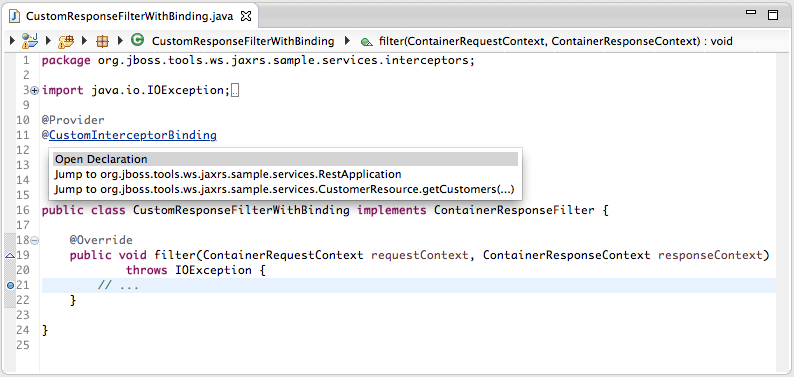

= WebServices Tools 1.7.0.Beta1 What's New
:page-layout: whatsnew
:page-component_id: webservices
:page-component_version: 1.7.0.Beta1
:page-product_id: jbt_core 
:page-product_version: 4.2.0.Beta1

== Server-side JAX-RS 2.0 Support

JAX-RS 2.0 is part of JavaEE7 and JBoss Tools now provides you with support for this update of the specification. 

=== JAX-RS Filters and Interceptors

The JAX-RS tooling now detects server-side JAX-RS Interceptors and Filters, i.e., implementations of `javax.ws.rs.ext.ReaderInterceptor`, `javax.ws.rs.ext.ResponseInterceptor`, `javax.ws.rs.container.ContainerRequestFilter` and `javax.ws.rs.container.ContainerResponseFilter`.

Such implementations are included into the JAX-RS Metamodel associated with the parent Eclipse project, and the JAX-RS validation does not complain anymore when they are annotated with `@Provider`.

related_jira::JBIDE-16753[]

=== Custom Name Binding annotation

The new `@NameBinding` meta-annotation is detected when found on a user-defined annotation. This user-defined annotation can be used to bind specific Filters and Interceptors to a Resource Method or a Resource (and hence, all methods of this resource) or to the whole Application. 

[source,java]
----
@Target({ ElementType.TYPE, ElementType.METHOD })
@Retention(value = RetentionPolicy.RUNTIME)
@NameBinding
public @interface CustomInterceptorBinding {}
----

related_jira::JBIDE-16824[]

=== Validation

The JAX-RS validator reports a problem if the user-defined `@NameBinding` annotation(s) on a *Filter* or *Interceptor* is(are) not bound to a *Resource*, a *Resource Method* or the *Application* (and vice-versa), as the JAX-RS Specification states:

____

A filter or interceptor class can be decorated with multiple binding annotations. In this case, in accordance with the semantics described in CDI, all those annotations must be present in the resource class or method for the binding to be established. 
____

Also, the `@PreMatching` annotation is only allowed on implementations of `javax.ws.rs.container.ContainerRequestFilter` (in which case, the user-defined Container Request Filters are invoked before the Resource method is matched). The JAX-RS Validator will report a problem if this annotation is used on any other type of JAX-RS element.

related_jira::JBIDE-16752,JBIDE-16754[]

=== Hyperlink navigation based on Name Binding

When a Filter or Interceptor is annotated with a user-defined name binding annotation, then an hyperlink on this annotation provides the user with navigation to the associated resources/resource methods/application that have the same user-defined annotation (and vice-versa).

For example:

[source,java]
----

@Target({ ElementType.TYPE, ElementType.METHOD })
@Retention(value = RetentionPolicy.RUNTIME)
@NameBinding
public @interface CustomInterceptorBinding {

}
----

with

[source,java]
----

@ApplicationPath("/app")
@CustomInterceptorBinding 
public class RestApplication extends Application {

}
----

and

[source,java]
----

@Provider
@CustomInterceptorBinding
public class CustomResponseFilterWithBinding implements ContainerResponseFilter {

	@Override
	public void filter(ContainerRequestContext requestContext, 
                     ContainerResponseContext responseContext)
			throws IOException {
		...
	}
}
----

In that case, ctrl (or cmd) ` click on `@CustomInterceptorBinding` allow for navigation between all those 3 classes.

related_jira::JBIDE-16829[]

== JAX-RS Endpoint template

The JAX-RS Endpoint templates that are displayed in the *Project Explorer* have been updated: each parameter name in the *@Path*, *@QueryParam* and *@MatrixParam* annotations is followed by its type as shown below: 

* `/rest/customers/{id:Integer}` (a @Path named `id` and of type `java.lang.Integer`)
* `/rest/customers?start={int}&size={int:20}` (two @QueryParam parameters, named `start` and `size`, both primitive `int`, the later one with the optional `@DefaultValue` set to `20`).
 
related_jira::JBIDE-12029[]

