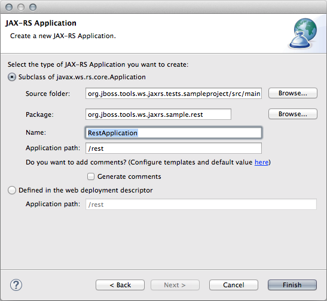
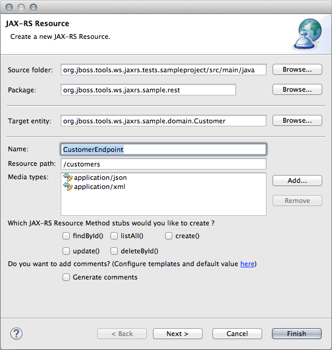
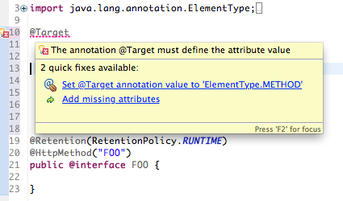

= WebServices Tools 1.7.0.Beta2 What's New
:page-layout: whatsnew
:page-component_id: webservices
:page-component_version: 1.7.0.Beta2
:page-product_id: jbt_core 
:page-product_version: 4.2.0.Beta2

== New JAX-RS Wizard for Resource and Application creation

Two new JAX-RS wizards now replace the former "Create Sample RESTFul Web Services" wizard:

- a wizard to create a new *JAX-RS Application*. This wizard lets the user choose between creating a subclass of +javax.ws.rs.core.Application+ or defining a +<servlet-mapping>+ element in the project's web deployment descriptor.

- a wizard to create a new *JAX-RS Resource*. This wizard provides the user with default settings for the class name, the +@Path+ value at the type level and the supported media-types (by default, +application/json+ and +application/xml+). The wizard also provides with code skeleton generation for CRUD methods.

The JAX-RS Resource creation wizard also allows for JAX-RS Application creation if none already exists in the project. This step can be skipped if the user plans to deploy her project on a non-Java EE platform. A third option, labelled "Skip the JAX-RS Application creation", is displayed on the "JAX-RS Application" dialog page shown above. 

The JAX-RS Resource wizard can be invoked from "File>New" in the menu bar and in the project's menu. It also appears in the Servlet group in the toolbar, both in the Java EE and JBoss perspectives.

Both JAX-RS Resource and Application wizards can be invoked from a selected element in the Project Explorer, including classes, packages, source folders and the "JAX-RS Web Services" node. The default values will depend on the current selection.

related_jira::JBIDE-17151[]

== JAX-RS parameters validation and support for ParamConverterProviders
 
The JAX-RS tooling now validates the parameter types in the Resource Methods. In particular, it verifies that the parameter types meet one of the following requirements: 

1. Primitive types.
2. Types that have a constructor that accepts a single String argument.
3. Types that have a static method named valueOf or fromString, with a single String argument that return an instance of the type.
4. List<T>, Set<T>, or SortedSet<T>, where T satisfies #2 or #3 above.
5. Types for which a ParamConverter is available via a registered ParamConverterProvider (new addition in JAX-RS 2.0).

related_jira::JBIDE-15592,JBIDE-16763[]

== Quickfixes

When defining custom *NameBinding* and *HttpMethod* annotations, the +@Target+ and +@Retention+ meta-annotations must be set with appropriate values. Not only the JAX-RS Tooling has been recognizing those custom annotations and validating the values of the aforementioned meta-annotations for a while, but it also now provides users with quickfixes to set the expected values from the error marker in the Java editor (and not only from the Markers view).

related_jira::JBIDE-17177[]

== JAX-RS 2.0 Support

Tooling for server-side JAX-RS 2.0 development is almost complete (see link:./4.2.0.Beta1.html#webservices[New and Noteworthy of JBoss Tools 4.2.0.Beta1]). The 2 remaining features to implement are:

- Support for +@BeanParam+ annotation on Resource Methods parameters and Resource fields. This annotation allows for injection user-defined beans whose fields and properties may be annotated with JAX-RS param annotations.
- Provide JAX-RS Fields type validation. This is a similar feature to what's been implemented in this release with regards to Resource Method parameter validation, but applied on Resource fields.

related_jira::JBIDE-16329[]