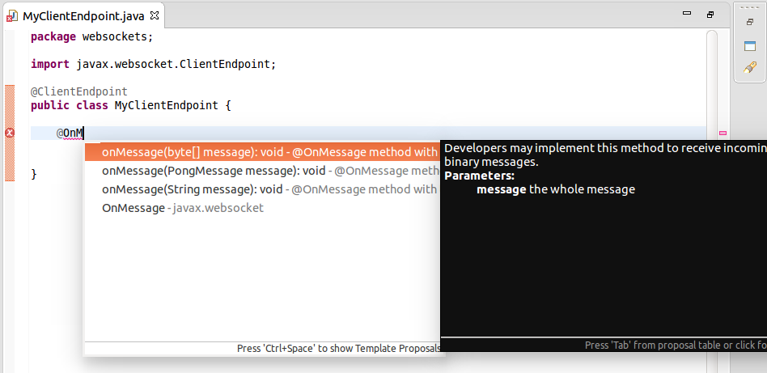

= WebServices Tools 1.8.0.Beta1 What's New
:page-layout: whatsnew
:page-component_id: webservices
:page-component_version: 1.8.0.Beta1
:page-product_id: jbt_core
:page-product_version: 4.3.0.Beta1

== Content Assist for Methods in Websocket Endpoint Classes

Content assist for methods in Websocket endpoint classes is now added.

Websocket endpoint classes are classes annotated with javax.websocket.server.ServerEndpoint or javax.websocket.ClientEndpoint.
They can have methods annotated with *@OnClose*, *@OnError*, *@OnMessage*, *@OnOpen*.

Content assist provides the following options:

- `onClose(Session session, CloseReason closeReason): void` - @OnClose method for WebSocket endpoint

- `onError(Session session, Throwable throwable): void` - @OnError method for WebSocket endpoint

- `onMessage(String message): void` - @OnMessage method with text message for WebSocket endpoint

- `onMessage(byte[] message): void` - @OnMessage method with binary message for WebSocket endpoint

- `onMessage(PongMessage message): void` - @OnMessage method with pong message for WebSocket endpoint

- `onOpen(Session session, EndpointConfig endpointConfig): void` - @OnOpen method for WebSocket endpoint

Each option can only be used once. After being used once, the option does not appear in the choices.

Use Content assist from any position to add a new class member. Use prefixes to reduce the choice list. For example, if `onO` or `@onO` is typed and Content Assist is invoked, only `onOpen` choice will be suggested.

Example of inserted code:

[source,java]
----
	@OnOpen
	public void onOpen(Session session, EndpointConfig endpointConfig) {
		// TODO Auto-generated method stub
	}

----

related_jira::JBIDE-19739[]
