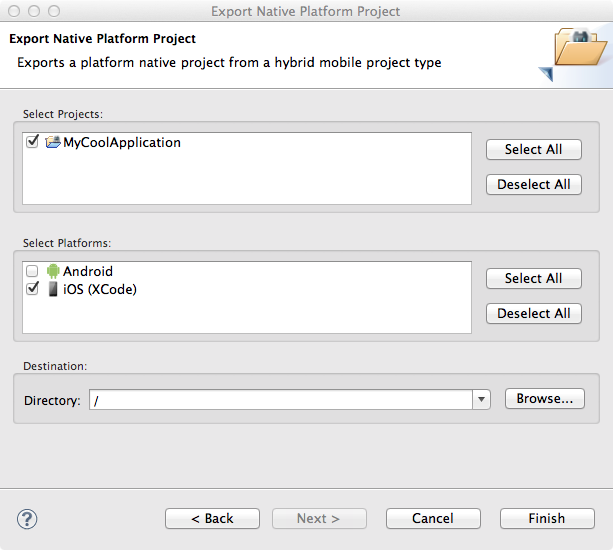

= Aerogear 
:page-layout: features
:page-product_id: jbt_core
:page-feature_id: aerogear
:page-feature_order: 8
:page-feature_tagline: Mobile development tooling
:page-feature_image_url: images/aerogear_icon_256px.png
:page-issues_url: https://issues.jboss.org/browse/JBIDE/component/12317246

== Hybrid Mobile (Cordova) Tools
=== Develop mobile apps that run on iOS or Android
image::images/features-aerogear-hybridmobile-wizard.png[]

With the Hybrid Mobile (Cordova) Tools you get to create a mobile project that uses
Apache Cordova. The projects can be used and developed fully in Eclipse, but is also
compatible with cordova-cli projects.

== Multiple engine versions
=== Target past and future

Download of the specific version you are targeting is possible from the projects preferences.
Allows you to do maintenance on one version and target new development on a new version, within
the same toolset.

== Cordova Configuration Editor
=== Form based configuration editor
image::images/features-aerogear-cordova-config-editor.png[]

Edits the config.xml for your Apache Cordova projects.

== Run your app 
=== Test on device, emulator or simulator

Creates, compiles and runs the native application on the native platform emulators and devices.

* Run on iOS Simulator. Creates and compiles a XCode project and runs the resulting artifacts on the iOS simulator.
* Run on Android Emulator Creates and compiles an Android project and runs it on the Android emulator.
* Run on Android Device Runs the project on an Android device if there is one attached.
* Run with CordovaSim Runs the project on the CordovaSim

== Export Native Platform Project Wizard
=== Export to XCode or Android project

If you want to do native level fixes or builds you can Export your mobile hybrid project
to either as an Android project or XCode project.

== Cordova Plug-in Discovery Wizard
=== Install plugins from a registry, git repository or a directory

Discover and install Cordova Plug-ins from a registry to your Hybrid
Mobile projects. Wizard also enables installation of plug-ins via a
Git repository or from a directory.

== Plugins in Explorer
=== Visual feedback
image::images/features-aerogear-explorer-extensions.png[]

When a plugin is installed into a project it is installed into the 'plugins' directory
and will show up with corresponding icon in the Project Explorer.

