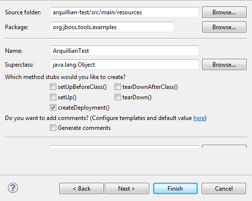
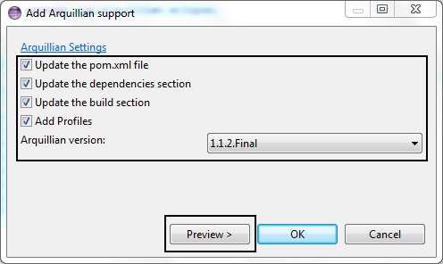
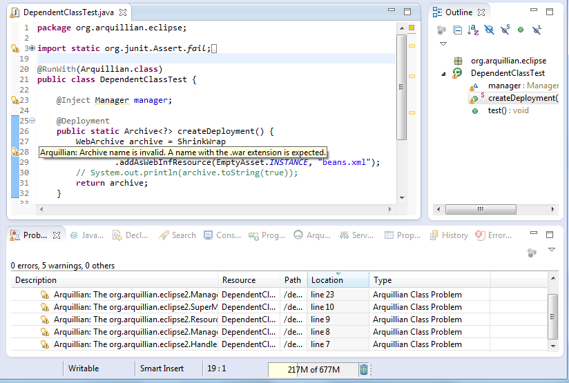
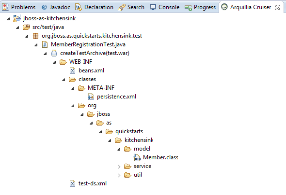

= Arquillian 
:page-layout: features
:page-feature_id: arquillian
:page-feature_order: 8
:page-feature_tagline: Arquillian Tooling
:page-feature_image_url: images/arquillian_icon_256px.png
:page-issues_url: https://issues.jboss.org/browse/JBIDE/component/

== Arquillian Eclipse
=== Makes using Arquillian easier 

Arquillian Eclipse is a JBoss Tools component that makes it simple to create and maintain Arquillian tests.
It provides adding Arquillian artifacts to a project as well as creating, validating and running Arquillian JUnit tests.

== Arquillian support
=== Add Arquillian support to an existing project

You can add Arquillian capabilities to the existing Eclipse project and control changes to the pom.xml file.

== Arquillian JUnit test
=== Create an Arquillian JUnit test

Arquilian Eclipse enables you to create Arquillian JUnit tests and generate a deployment method.

There is also the *Run As/Debug As>Arquillian JUnit Test* action that checks if the Arquillian test environment is valid.

== Arquillian validator 
=== Validate the Arquillian environment

The arquillian validator finds the following issues:

* classes that are used in a test, but aren't included in the deployment
* tests without a deployment method and/or a test method
* resources that can't be found 
* invalid archive name

The most of the issues have an Eclipse quick fix.

== Arquillia Cruiser
=== Review a Shrinkwrap archive

Review the content of a Shrinkwrap archive using the Arquillia Cruiser view.
