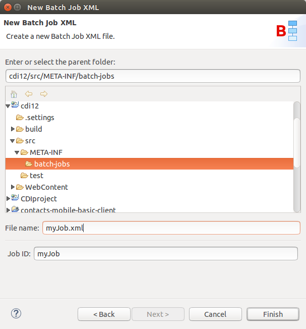
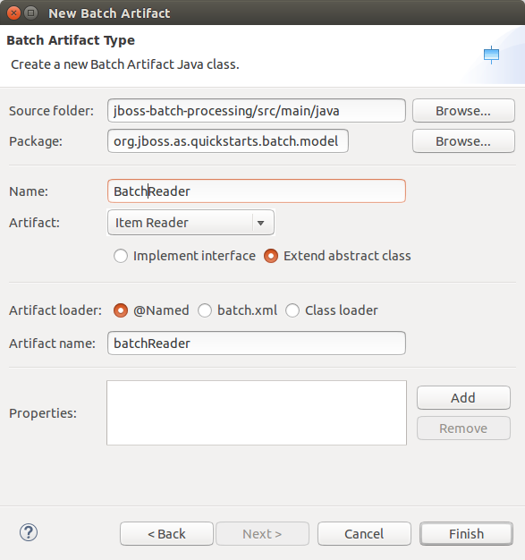
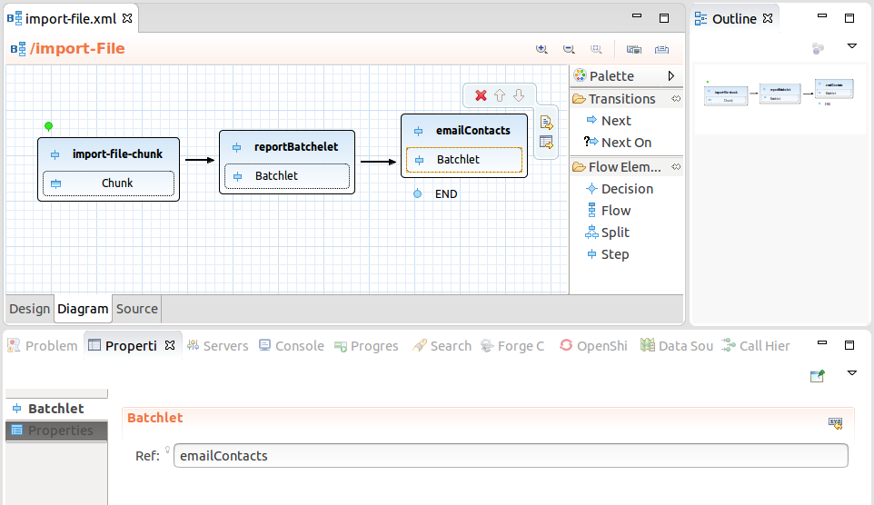
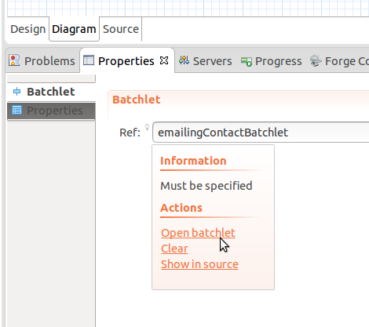
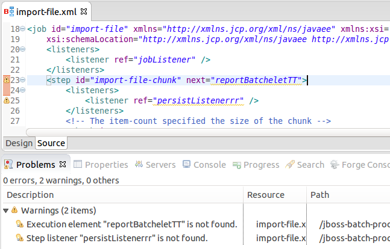
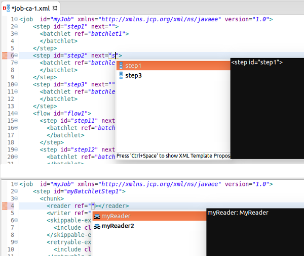
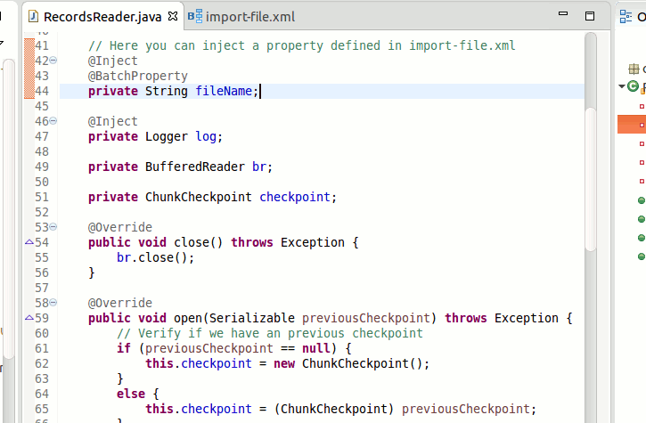
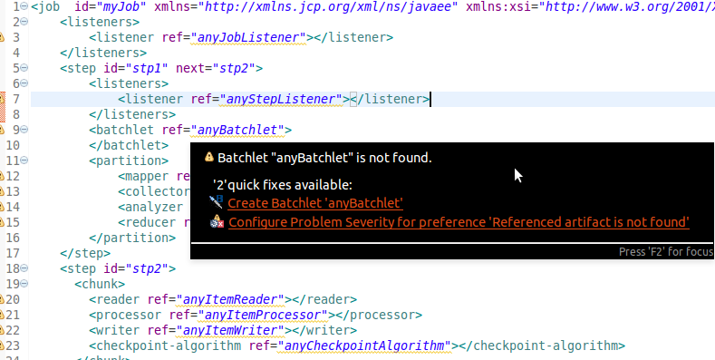
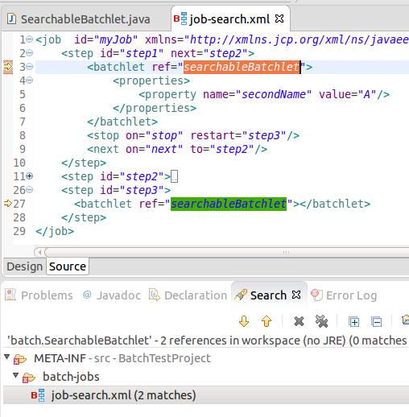
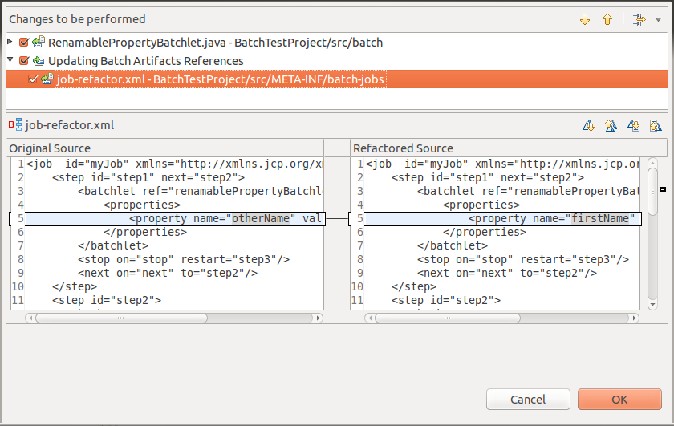

= Batch Tools
:page-layout: features
:page-product_id: jbt_core
:page-feature_id: batch
:page-feature_order: 8
:page-feature_tagline: JavaEE 7 Batch Processing
:page-feature_image_url: images/batch_icon_256px.png
:page-feature_deprecated: true
:page-issues_url: https://issues.jboss.org/browse/JBIDE/component/12320844

== JavaEE 7 Batch Processing
=== Makes using Batch easier

Batch Tools help users develop Java applications that use the Batch Processing programming mode. Batch Tools also include features such as New Job XML, New Batch Artifact Wizards, Advanced Visual and Source Editors for Job XML files, as well as project validation.

== Wizards
=== New Job XML file. New Batch Artifacts

Wizards allow you to easily create new Batch Job XML files and batch artifacts.

== Batch Job XML Editor
=== Visualization and editing

* Visualization of structure of batch job
* Other properties editable via context actions and linked property views
* Reordering
* Content proposals for batch artifacts

== Properties Editor
=== Edit and navigate

To navigate from the Properties editor to the corresponding batch artifact, click the icon at the property name and select 'Open <artifact>'.
If no artifacts are included, click the 'Create <artifact>' link. This starts the 'New Batch Artifact' wizard.

== Validation
=== Preventing problems

Batch artifact and property references are validated in Job XML files.

== Content Assist
=== Easy coding

Content assist works for any class attribute (used to reference exception classes). Just type the first letter of the class or name and the content assist will show all available proposals.
Job XML Editor also provides content assist for <* ref="">, <* next="">, <* to="">, <* restart=""> and for batch properties.

== Hyperlink Navigation
=== Quick access to source

Batch artifacts can be navigated to via OpenOn. Just press Ctrl and click on <* ref="">, <* next="">, <* to="">, <* restart="">
or property name to open the corresponding source code or Job XML element.

== Quick Fixes
=== Problem solved

There are Quick Fixes available for the validation problems in Batch Job XML source editor.

== Search for Batch Artifacts
=== Find references

Search for references (Ctrl+Shift+G) works for batch artifact classes and its property fields.

== Batch Artifact Renaming
=== Rename references

When you rename some class name or property field then the corresponding Job XML references will be renamed too.