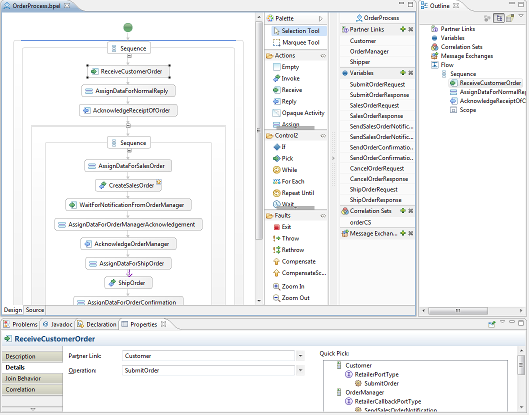

= BPEL Editor
:page-layout: features
:page-product_id: jbt_is 
:page-feature_id: bpel
:page-feature_image_url: images/bpmn2-logo-3.png
:page-feature_highlighted: false
:page-feature_order: 10
:page-feature_tagline: Your Business Process Execution Language Editor

== BPEL Editor

=== _What is BPEL?_

Business Process Execution Language (BPEL) is an XML based language that enables task sharing in a distributed
computing environment. It uses easy to understand commands that perform complex functions. All the processes in 
BPEL, export and import information by using web service interfaces only. 

JBoss BPEL is based on WS BPEL 2.0, and provides a way to create, edit, validate and deploy BPEL files to JBoss 
BPEL runtime. It is based on Eclipse BPEL project.

It improves the Eclipse BPEL project in the following ways:

* Implements close integration with JBoss BPEL runtime, and adds a new project type for the deployment to the JBoss BPEL runtime.
* Supports two deployment methods. The first method is to deploy a BPEL project directly to the JBoss BPEL runtime. The second method is to deploy BPEL files in JBoss ESB project to the JBoss BPEL runtime.
* Enhances the BPEL validator and improves the quality of the Eclipse BPEL editor. 

WS BPEL 2.0 stands for Web Service Business Process Execution Language. Like EAI, BPEL is an XML based language, 
but BPEL is more specific and targeted. BPEL is used by developers to join sometimes disparate functions into 
an integrated process, resulting in a seamless use of the Internet to conduct business transactions ranging 
from simple money exchanges to complex calculations and asset reallocation. 

=== Key Features

* WS BPEL 2.0 support
JBoss BPEL project supports the most recent WS BPEL 2.0 specifications.

* Close integration with JBoss BPEL runtime
There are two methods to deploy BPEL files to JBoss BPEL runtime. The user can deploy a BPEL project as a whole 
and can deploy BPEL files in a JBoss ESB project to the JBoss BPEL runtime.

* BPEL file editor	
The editor can be used separately to edit a BPEL file. 

* BPEL file validator
The validator displays a list of BPEL file errors. 

=== BPEL Perspective

BPEL carries its own perspective in Eclipse.  It is designed to facilitate the development of BPEL processes and 
their artifacts.  It also has its own BPEL Project Wizards for creating BPEL projects and processes (BPEL/ WSDL).

=== BPEL Deploy

You may deploy a BPEL project to a JBoss BPEL Runtime by means of a deploy.xml file that you can create with the 
Apache ODE Deployment Descriptor wizard. 

=== BPEL Runtime

Once you have installed the JBoss BPEL Runtime RiftSaw, you can create a server for JBoss BPEL runtime with the 
'New Server' wizard.  Then deploy and start the server.

=== _What are correlation sets?_

Correlation sets are used to identify ongoing conversations between a client and the BPEL process. Typically, a 
correlation is an element in a message that uniquely identifies the conversation between client and service; for 
example, an Order ID or Social Security Number. This also identifies a specific process instance being managed 
by the BPEL engine.  In many cases a single element of a message is not enough to make it unique, so correlations 
can be defined as composites of several fields. Since a conversation can involve many different types of messages. 
Different correlations will need to be defined for each message type.

BPEL supports the creation of correlation sets for a messaging activity (for example: Invoke, Receive, Reply) by 
means of the Correlation Detail property tab. 

