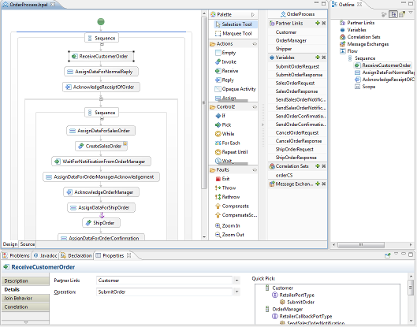
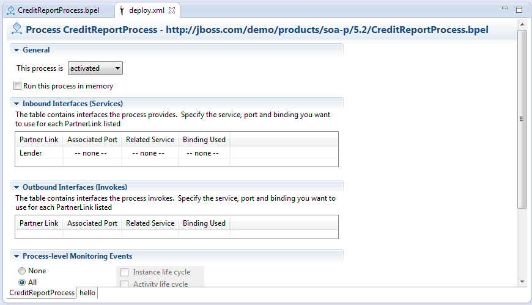
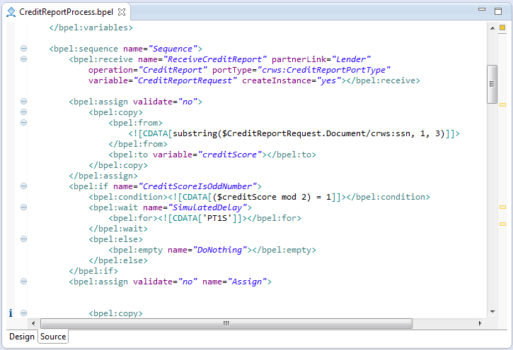
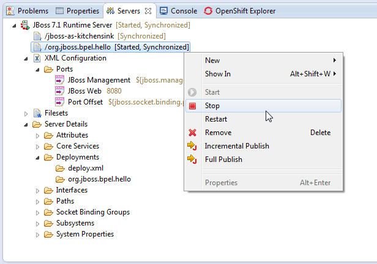
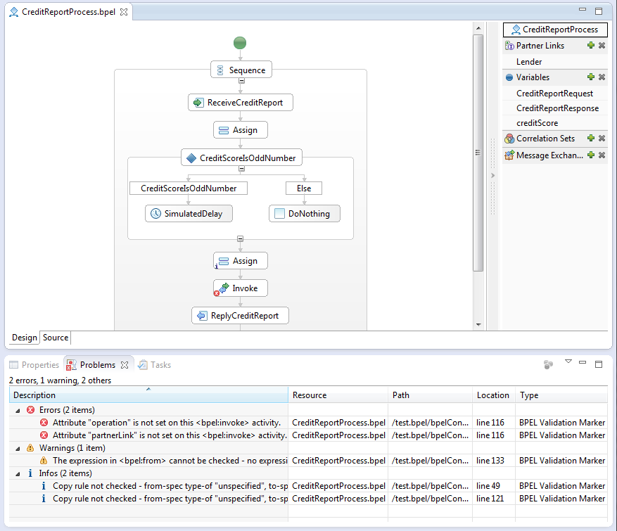

= BPEL Designer
:page-layout: features
:page-product_id: jbt_is 
:page-feature_id: bpel
:page-feature_image_url: images/bpel-logo.png
:page-feature_highlighted: false
:page-feature_order: 10
:page-feature_tagline: Orchestrating your business processes

== BPEL Editor
=== The Business Process editor

The BPEL editor supports the Business Process Execution Language (BPEL), an XML based language defined by the http://www.oasis-open.org[*OASIS Consortium*].
BPEL uses Web services standards to describe business process activities as Web services, defining how they can be composed to accomplish specific tasks.

JBoss BPEL is based on WS-BPEL 2.0, and provides a way to create, edit, validate and deploy BPEL files to
the JBoss BPEL runtime.

== JBoss BPEL
=== Build a Better BPEL
 

JBoss BPEL extends the Eclipse BPEL Designer project with the following enhancements:

* Close integration with JBoss, and adds a new project type for deployment to the JBoss BPEL runtime.
* Supports two deployment methods. The first method is to deploy a BPEL project directly to the JBoss BPEL runtime. The second method is to deploy BPEL files in JBoss ESB project to the JBoss BPEL runtime.
* Enhances the BPEL validator and improves the quality of the Eclipse BPEL editor. 

== WS-BPEL
=== Latest 2.0 Specification

JBoss BPEL supports the most recent WS-BPEL 2.0 specification.

== JBoss BPEL Runtime
=== Close integration

There are two methods to deploy BPEL files to JBoss BPEL runtime. The user can deploy a BPEL project as a whole 
or deploy BPEL files in a JBoss ESB project to the JBoss BPEL runtime.

== Validation
=== Pinpoint errors without the complexity

The Problems view displays incorrect or incomplete process definitions.
Navigate directly to the offending BPEL element and quickly fix errors by double-clicking on a Problem line item. 

