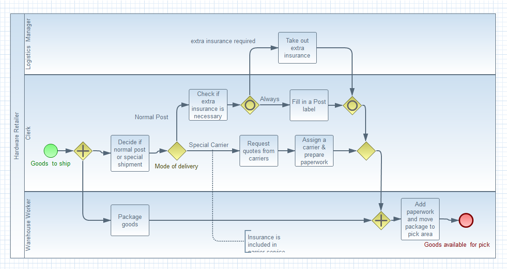
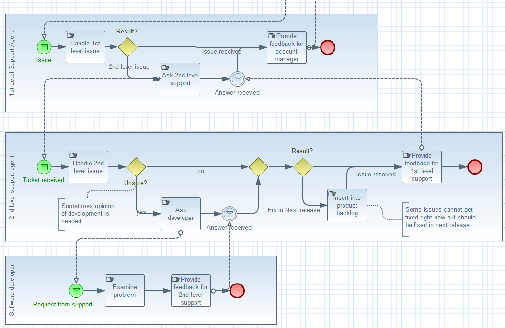
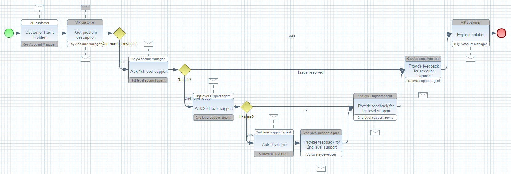

= BPMN2 Modeler
:page-layout: features
:page-product_id: jbt_is 
:page-feature_id: bpmn2
:page-feature_image_url: images/bpmn2-logo.png
:page-feature_highlighted: false
:page-feature_order: 10
:page-feature_tagline: Modeling your enterprise 

== BPMN2 Modeler
=== Modeling for your enterprise

image::images/features-bpmn2-modeler-ui-589px.png[BPMN2 Modeler Editor]

The BPMN2 Modeler is fully compliant with the http://www.omg.org/spec/BPMN/2.0/[*OMG BPMN 2.0 specification*].
Based on the Eclipse Graphiti framework, BPMN2 Modeler makes working with BPMN 2.0 as easy as drag-n-drop. 

== Design your jBPM Processes?
=== Yeah, we've got that!

image::images/features-bpmn2-modeler2.png[]

BPMN2 Modeler is all about extensibility and customization.
An extension plug-in customizes the editor for jBPM and makes the generated process files fully compatible with the jBPM execution engine and the jBPM Web Designer.  

== Document your enterprise wide business processes? 
=== We've got that too!

image::images/features-bpmn2-diagram-wizard.png[]

BPMN2 Modeler is much more that just a process designer.
It can also be used to document all of your internal business processes and how your organization interacts with other business units or business partners.
What UML is to object modeling, BPMN2 is to enterprise modeling.

The Diagram Wizard helps you decide how to document your process-driven organizational models.
Different diagram types allow you to visualize your processes from different perspectives and model exactly how your organization works.

== Go with the flow
=== and use Process Diagrams

Process Diagrams describe a sequence or flow of Activities in an organization with the objective of carrying out work.
A Process contains Activities, Events, Gateways, and Sequence Flows that define its execution semantics.

== Work with your partners
=== using Collaboration Diagrams

Collaboration Diagrams are a collection of Participants shown as Pools, and their interactions as shown by Message Flows.
A Collaboration Diagram may also include Processes within the Pools and/or Choreographies between the Pools.

== Arrange the dance
=== with Choreography Diagrams

Choreography Diagrams formalize the way business Participants coordinate their interactions. The focus is not on orchestrations of the work performed within these Participants, but rather on the exchange of information (Messages) between these Participants.
