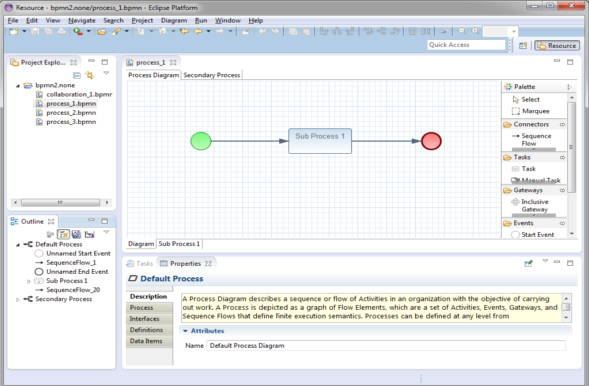
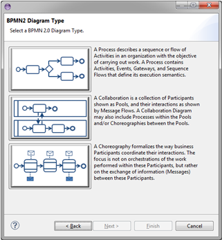

= BPMN2 Modeler
:page-layout: features
:page-product_id: jbt_is 
:page-feature_id: bpmn2
:page-feature_image_url: images/bpmn2-logo-3.png
:page-feature_highlighted: false
:page-feature_order: 10
:page-feature_tagline: A graphical modeling tool for your BPMN (Business Process Modeling Notation) diagrams. 

== BPMN2 Modeler

=== _Where did the BPMN2 Modeler come from?_

The foundation of the BPMN2 Modeler is the Eclipse BPMN2 Metamodel, which was developed by contributing members of the OMG BPMN 2.0 working group and is fully compliant with the spec. However, the BPMN2 Modeler UI surfaces only the most commonly used elements, simply because the model is incredibly complex and all-inclusive. In the real world, most BPMN execution engines only support a subset of the spec, and the BPMN2 Modeler can be easily customized to target any spec-compliant runtime with User Preference settings and/or specialized extension plug-ins.

=== BPMN2 Modeler Anatomy

BPMN2 Modeler has all of the features of a well-behaved Graphiti editor: the Drawing Canvas in the main area of the editor window, collapsible Tool Palette on the right, tabbed Property sheets, and an Outline Viewer with both tree and thumbnail views.

=== _How can I create a new BPMN2 diagram file?_

The Eclipse New File wizard is used to create a new BPMN2 file.  BPMN2 provides wizards in support of the following file types:

==== BPMN2 Model

The BPMN2 Model is contributed by the Eclipse BPMN2 Metamodel plug-in.  It creates an empty BPMN2 file containing only a root element. When this is opened with the BPMN2 Model Editor (a simple tree-oriented editor also contributed by the BPMN2 Metamodel plug-in) you can view the physical structure of a BPMN2 file.

==== Generic BPMN 2.0 Diagram

The BPMN 2.0 Diagram (contributed by the BPMN2 Modeler plug-in) can be used to create a new, properly initialized Diagram file. This wizard creates a file that is not intended for deployment to any particular BPM process engine.

==== JBPM Process Diagram

Part of the BPMN2 Modeler extension mechanism is the ability for plug-ins to contribute New File wizard entries. These will appear as additional entries under the BPMN2 category.  The jBPM Process Diagram wizard is specifically designed to create a process suitable for deployment to the jBPM engine.

=== _What detailed information can I gather about BPMN2 elements in my diagram?_

BPMN2 uses property tabs to convey specific details about selectable diagram objects.  For instance...

==== Process Diagram

This Property Tab is displayed when the Drawing Canvas is clicked, or if a Process element is selected from the Outline View.  The following property tabs are available:

* Process
* Interfaces
* Definitions
* Data Items

==== Activity

Property Tabs are available for these Activities:

* Task
* Manual Task
* Script Task
* Business Rule Task
* Receive Task
* Send Task
* Service Task
* Sub-Process
* Transaction
* User Task
* Ad Hoc Sub-Process
* Call Activity

==== Gateway

Property tab information on gateways informs the user of:

* Gateway Direction
* Sequence Flow List 
* Condition Expression

==== Events

Events come in three flavors: Catching, Throwing and Boundary. The Boundary Event is also a Catching event, but is attached to an Activity. All Event types have an Event Definitions List.

==== Data Items

Property tab information is available for the following three categories of Data Items:
* Data Objects
* Data Inputs and Outputs
* Data Stores

==== Sequence Flows

The Sequence Flow Property Tab allows an optional condition expression to be added to the Sequence Flow.

=== Supported Pop-Up Dialogs

Popup dialogs are used throughout the editor to prompt for additional configuration information or command confirmation.  The most interesting popup dialogs are:

* BPMN2 Element Property
* Data Type (“Item Definition”) Editing Dialog 
* Variable ("Property") Editing Dialog
* Message Editing
* Error Editing 
* Signal Editing
* Escalation Editing 
* Data Store Editing 
* File Import 
* Import Editing
* Namespace Editing
* Edit Resource
* Edit Resource Parameter
* Edit Resource Role 
* Export Diagram 

=== Supported Outline Views

The Outline has three different views of the file:

* Business Model View – this roughly corresponds to the graphical elements on the drawing canvas, but also includes model elements that do not necessarily have a visual representation such as Data Types, Interfaces, Operations, Process variables and so on.
* Diagram Interchange Model – this displays the DI model, which is that part of the spec that defines visual presentation details such as locations and sizes of shapes, connection bend points, labels, etc. This view is useful for visualizing the graphical elements and their relationships and containments.
* Thumbnail – this is simply a small overview of the entire diagram scaled to fit into the Outline View window.

=== _What target runtime extensions are supported?_

While it has its merits as a graphical modeling tool to simply document complex business processes, BPMN2 Modeler was primarily designed to be used by software architects for building artifacts that can be deployed, and executed by a business process engine. The authors of the BPMN 2.0 spec have intentionally left many of the implementation details for execution engines open to interpretation by software vendors because they understood that software and hardware technologies are constantly evolving and BPMN2 Modeler was designed to evolve with them.  The so-called “Target Runtime” represents a specific BPM engine technology and is encapsulated by an extension plug-in. BPMN2 Modeler defines a flexible, and open programming API to facilitate development of new Target Runtime plug-ins by third-party vendors. These plug-ins may contribute one or more components to BPMN2 Modeler, for example:

Extension Models in the form of EMF model definitions:

* Tool Profiles
* Property View tabs
* Preference Pages
* Editor UI components (Dialogs, Menus, behavior, etc.)
* New File Wizards
* Model Validation constraints

A Target Runtime is defined on a Workspace Project using the Project Property Page (from the Project’s Properties context menu action.) Once the Project has been declared as being associated with a specific Target Runtime, the extension plug-in that implements that Target Runtime will be invoked whenever a BPMN file needs to be edited, created, validated or manipulated in any way required by the Target Runtime.  One such Target Runtime has already been developed as part of the BPMN2 Modeler project and, indeed was the inspiration behind many of the design decisions made during development. The jBPM Target Runtime demonstrates BPMN2 Modeler’s extensibility.

