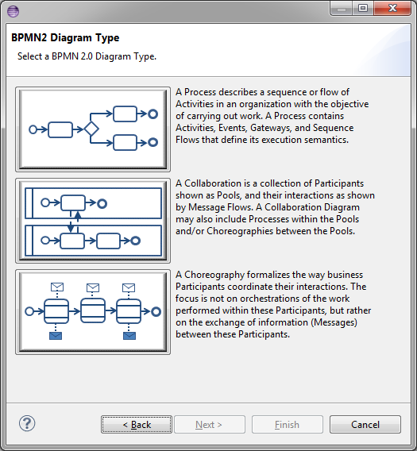

= BPMN2 Modeler
:page-layout: features
:page-product_id: jbt_is 
:page-feature_id: bpmn2
:page-feature_image_url: images/bpmn2-logo-3.png
:page-feature_highlighted: false
:page-feature_order: 10
:page-feature_tagline: BPMN for you 

== BPMN2 Modeler
=== Modelling with a spec

image::images/features-bpmn2-modeler-ui-589px.png[BPMN2 Modeler Editor]

The BPMN2 Modeler uses the standard OMG BPMN2 2.0 working group model and is fully compliant with the spec.

== BPMN2 Modeler Anatomy
=== Graphiti rocks

image::images/features-bpmn2-modeler2.png[]

BPMN2 Modeler uses Graphiti to provide a Drawing Canvas in the 
main area of the editor window, collapsible Tool Palette on the right, tabbed Property sheets, and 
an Outline Viewer with both tree and thumbnail views.

== Diagram Wizard
=== New BPMN2

The Eclipse New File wizard is used to create a new BPMN2 file.  BPMN2 provides wizards in support of 
the following file types: BPMN2 Model, Generic BPMN 2.0 Diagram, JBPM Process Diagram.
