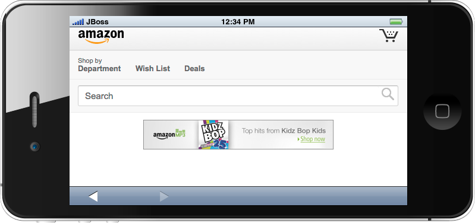

= BrowserSim 
:page-layout: features
:page-product_id: jbt_core
:page-feature_id: browsersim
:page-feature_order: 8
:page-feature_tagline: Mobile Browser Simulator
:page-feature_image_url: images/browsersim_icon_256px.png
:page-feature_deprecated: true
:page-issues_url: https://issues.jboss.org/browse/JBIDE/component/

== Browser Simulator
=== Simple, fast & beautiful 

BrowserSim is a browser simulator that is fast to launch,
provide simple and beautiful simulation of various mobile
phones and tables on the market.

BrowserSim allow you to take screenshots with all the skins,
support live reload and debugging.

== Turn your world upside down
=== Rotate landscape and portrait

You can rotate the phone to test if your web application
are reactive to landscape and portrait mode.

== Several ways to skin a cat
=== Size, resolution and skins

BrowserSim comes with a bunch of predefined skins and resolutions
allowing you to see how you website will look and feel.

== Synergized browsing
=== Browse on multiple devices
image::images/browsersim-opened-synchronized.png[]

For easy testing of multiple devices you can have multiple
views open each with different skin, resolution or rotation.

== Automatic reload
=== Refresh without F5

BrowserSim will automatically detect if you have a running
LiveReload server running and any change in your editor will
automatically get reloaded in BrowserSim - allowing you to
focus on writing content and coding functionallity.

