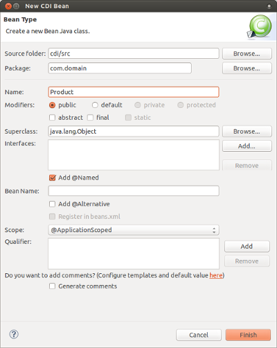
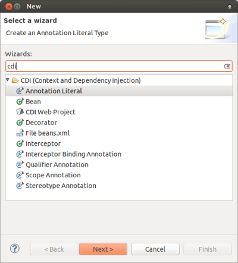
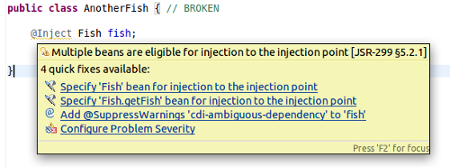
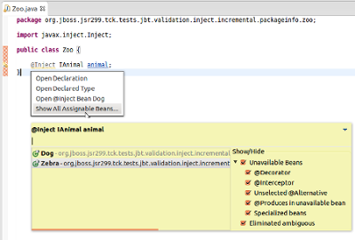
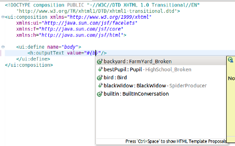
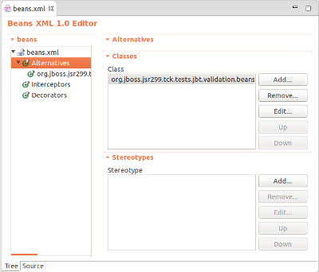

= CDI 
:page-layout: features
:page-product_id: jbt_core
:page-feature_id: cdi
:page-feature_image_url: images/java_ee_logo_vert_v2.png
:page-feature_order: 5
:page-feature_tagline: Bringing CDI to Eclipse
:page-issues_url: https://issues.jboss.org/browse/JBIDE/component/12311164

== Context Dependency Injection
=== Utilize the power of CDI

Context and Dependency Injection (CDI) tooling allows you to easily add and work with the CDI programming model for your web-based applications. Helps you adding CDI support to existing projects and create new projects with the CDI wizard. The tooling also provides you with validation, code completion and hyperlink navigation.

== CDI Wizards 
=== Easy coding

A bunch of wizards are available for easier creation of:

* CDI Web project
* Bean
* Interceptor
* Decorator
* Qualifier Annotation
* Scope Annotation
* Stereoptype Annotation
* Interceptor Binding Annotation
* Annotation Literal

and more.

== Validation 
=== Preventing definition and deployment problems

CDI Tools validation covers most of the problems defined in the CDI specification. There are more than a hundred validation rules including definition errors and deployment problems. Some of the problems can be fixed via Quick Fixes menu (Ctrl+1).

== Hyperlink Navigation 
=== Quick access to source

Hyperlinks help you to navigate between source files. For example Ctrl+Click or F3 on any injection point will navigate you to the corresponding bean definition. If the injection point has multiple eligible beans, you can see a full list of these beans. Navigation also works in beans.xml. Observers, Events, Producer and Disposer methods can be navigated via hyperlinks too.

== EL support 
=== The power of CDI + JSF

@Named beans and their properties/methods are available for code completion in XHTML files. CDI Tools also supports validation, hyperlink navigation, refactoring for EL expressions.   

== And More 
=== CDI Extensions, editors, dialogs,...

CDI support in JBoss Tools also includes beans.xml editor with code completion, navigation and validation. Related CDI Beans are added in a search result for field/method references search. Apache DeltaSpike support, "Open CDI @Named Bean" dialog and more... 
