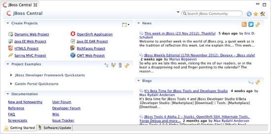
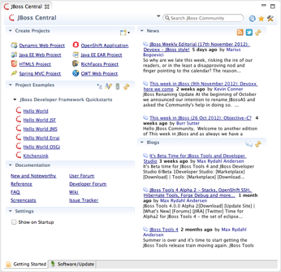

= JBoss Central
:page-layout: features
:page-product_id: jbt_core
:page-feature_id: central
:page-feature_image_url: images/features-central-logo.png
:page-feature_order: 1
:page-feature_tagline: Start your project faster
:page-issues_url: https://issues.jboss.org/browse/JBIDE/component/12314663

== JBoss Central
=== Start your project faster

JBoss Central is the startup page for JBoss Tools and JBoss Developer Studio. It helps you with projects wizards to
instantly start working with your favorite framework. It also provides you with community news and an easy way to
install extra plugins.  

== Get started instantly 
=== One click and you are off...

Central helps you bootstrap a new project by providing you with a large set of wizards and templates, 
including the JBoss Developer Frawework and the GateIn Quickstarts.   
Central also provides you with the latest community news, announcements and blog articles, 
so that you always know what's happening at JBoss.org.

== Extras plugins
=== Easy install
image::images/features-central-extras_334px.png[]

JBoss Central also features an easy way to install extra plugins, 
so you don't have to manually lookup and configure update sites for the other plugins you want to use. 
Amongst all the plugins, you'll find:

* JBoss SOA and Business Rules Tooling
* Google Plugin for Eclipe  + Google Web Toolkit
* Spring IDE
* Checkstyle
* Findbugs
* PMD
* JRebel
* Subclipse

and more...

