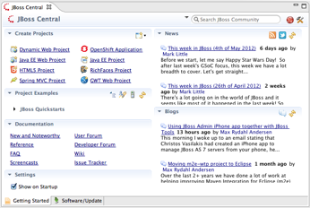

***
#### News  
Central provides you with the latest community news, announcements and blog articles, so that you always know what's happening at JBoss.org !

***
#### Getting Started 
Central also helps you start a new project by providing you multiple project creation wizards and quickstarts  

***
#### Extras 
Central also features an easy way to install extra software that is mirrored at JBoss.org, 
so you don't have to manually lookup and configure update sites for the other plugins you want to use. 
Amongst all the mirrored plugins, you'll find:

* JBoss SOA and Business Rules Tooling
* JBoss Maven GWT Configurator
* Google Plugin for Eclipe  + Google Web Toolkit
* Spring IDE
* Checkstyle
* Findbugs
* PMD
* JRebel
* Subclipse

and more...

