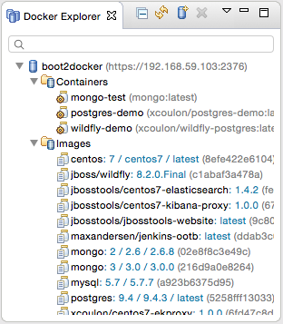
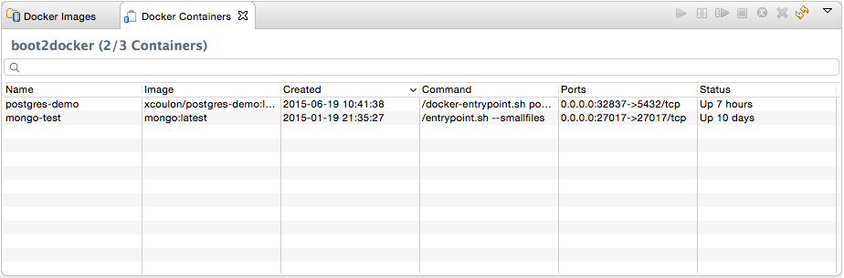
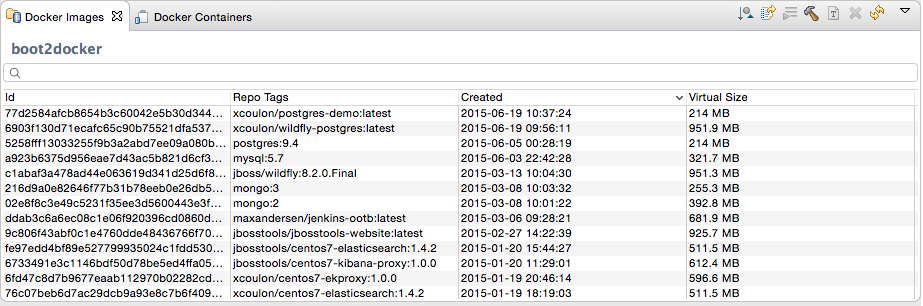
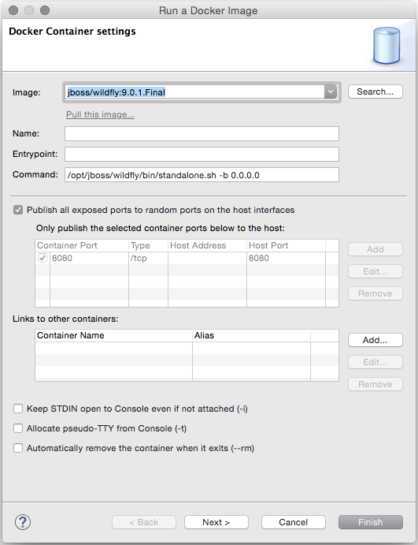
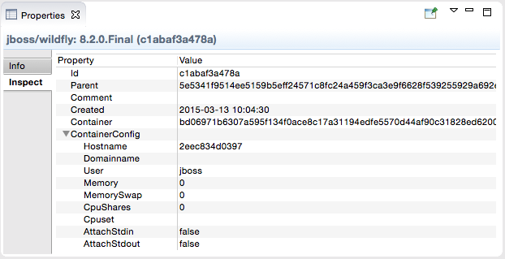

= Docker Tools
:page-layout: features
:page-product_id: jbt_core
:page-feature_id: docker
:page-feature_image_url: images/docker-logo.png
:page-feature_order: 1
:page-feature_tagline: Containerize your applications
:page-issues_url: https://issues.jboss.org/browse/JBIDE/component/12321304

== Docker Tools
=== Managing containers from the IDE
image::./images/docker-logo.png[Docker, width=200px, height=178px]

Tooling for Docker brings the support for managing containers inside Eclipse IDE.
This feature is part of the http://eclipse.org/linuxtools[Linux Tools project at Eclipse] and ships with JBoss Tools
and JBoss Developer Studio.
The goal of the Docker tooling is to integrate all the CLI features relevant for developers who
want to build and deploy applications on containers.

== Connection Wizard
=== Manage multiple connections modes in a single form
image::./images/features-docker_connection_wizard.png[Connection Wizard]

The `Connection` wizard support both Unix sockets and REST API to connect to a
Docker engine. The wizard requires a unique name to identify the connection and
checks the required permissions on the Unix socket and on the path to the certificates
 for TCP connections.

== Explorer View
=== Visualize your containers and images in a single treeview

The `Docker Explorer` view displays containers and images in a tree view, with
filters to hide dangling and intermediate images and stopped containers.

== Containers View
=== Detailed view of your containers

The `Docker Containers` view displays the same information that appears when using the
`docker ps` or `docker ps -a` commands in a terminal. This table view lists all the containers
or only the active ones, showing their id, image name, date of creation, run command, exposed ports
 and status.

== Images View
=== Detailed view of your images

The `Docker Images` view displays the same information that appears when using the
`docker images` command in a terminal. This table view lists all the images or the top-level
ones only, showing their id, repository name and tags, date of creation and status

== "Run Image" wizard
=== A wizard that understands your images

The `Run Image` wizard lets users run an image by passing the most relevant arguments in the context of a developer machine:

- the name of the container (although this is optional)
- the exposed ports (the table is prepopulated with port numbers retrieved from the selected Image information)
- the links to containers
- the data volume
- the environment variables

== Pull Images
=== Search and Pull images from any registry
image::images/features-docker_search_image_wizard1.png[Search Image Wizard]

The `Pull Image` wizard can be launched from the `Docker Images` view
 or from the `Docker Explorer` view. The wizard detects the tag in the image name
 and if none is specified, the image tagged `latest` is pulled. The companion `Search` wizard
 lets the user find the tagged image to pull from Docker Hub.

== Launcher to Build a Docker Image
=== Build and rebuild in a single click
image::images/features-docker_image_build_launcher.png[Build Image Launcher]

The Docker Tools also includes a launcher to build images from a Dockerfile.
The `source path` is a directory in the workspace or on the file system and the
`Docker Connection` combo box specifies on which Docker daemon the image will
be built.

== Properties view
=== Inspect selected containers and images

The `Properties` view responds to the selection on an Image or a Container in the
aforementioned views to display general and detailed information about the selected
connection, container or image.
