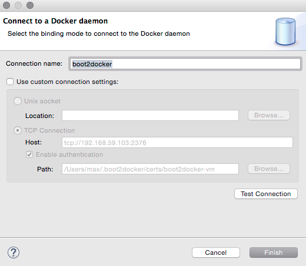
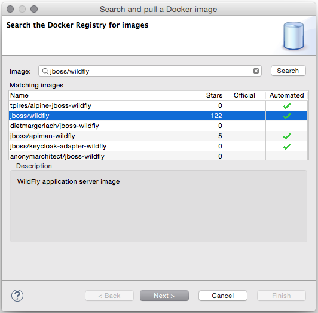

= Docker Tools
:page-layout: features
:page-product_id: jbt_core
:page-feature_id: docker
:page-feature_image_url: images/docker-logo.png
:page-feature_order: 1
:page-feature_tagline: Containerize your applications
:page-issues_url: https://issues.jboss.org/browse/JBIDE/component/12321304

== Docker Tools
=== Connection Wizard

The `Connection` wizard support both Unix sockets and REST API to connect to a
Docker engine. The wizard requires a unique name to identify the connection and
checks the required permissions on the Unix socket and on the path to the certificates
 for TCP connections.

== Explorer View
=== Visualize your containers and images in a single treeview
image::images/features-docker_explorer_view.png[Docker Explorer View]

The `Docker Explorer` view displays containers and images in a tree view, with
filters to hide dangling and intermediate images and stopped containers.

== Containers View
=== Detailled view of your containers
image::./images/features-docker_containers_view.png[Containers View]

The `Docker Containers` view displays the same information that appears when using the
`docker ps` or `docker ps -a` commands in a terminal.

== Images View
=== Detailled view of your images
image::./images/features-docker_images_view.png[Images View]

The `Docker Images` view displays the same information that appears when using the `docker images` command in a terminal.

== "Run Image" wizard
=== A wizard that understands your images

The `Run Image` wizard lets users run an image by passing the most relevant arguments in the context of a developer machine:

- the name of the container (although this is optional)
- the exposed ports (the table is prepopulated with port numbers retrieved from the selected Image information)
- the links to containers
- the data volume
- the environment variables

== Pull Images
=== Search and Pull images from any registry

The `Pull Image` wizard can be launched from the `Docker Images` view
 or from the `Docker Explorer` view. The wizard detects the tag in the image name
 and if none is specified, the image tagged `latest` is pulled. The companion `Search` wizard
 lets the user find the tagged image to pull from Docker Hub.

== Launcher to Build a Docker Image
=== Build and rebuild in a single click
image::images/features-docker_image_build_launcher.png[Build Image Launcher]

The Docker Tools also includes a launcher to build images from a Dockerfile.
The `source path` is a directory in the workspace or on the file system and the
`Docker Connection` combo box specifies on which Docker daemon the image will
be built.

== Properties view
=== Inspect selected containers and images
image::./images/features-docker_properties_view.png[Properties View, width=311, height=160]

The `Properties` view responds to the selection on an Image or a Container in the
aforementioned views to display general and detailed information about the selected
connection, container or image.
