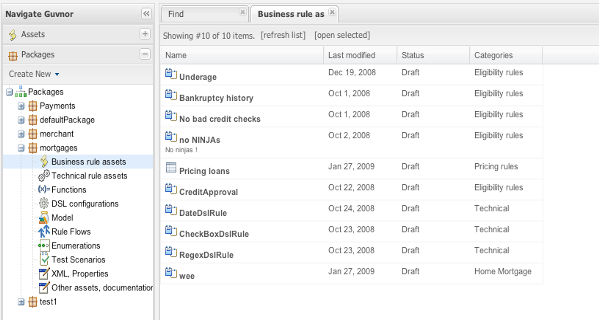
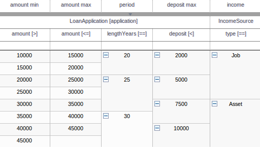

= Drools Guvnor
:page-layout: features
:page-product_id: jbt_is 
:page-feature_id: drools-guvnor
:page-feature_image_url: images/drools_icon_256px.png
:page-feature_highlighted: false
:page-feature_order: 10
:page-feature_tagline: The central repository for your Drools Knowledge Bases, with editors and tools to help organize large numbers of rules.

== Drools Guvnor

=== Knowledge Bases

Drools allows you to create executable knowledge bases. The repository component is where you can 
store versions of rules, models, functions, processes etc that all relate to these knowledge bases. 
Access is controlled, and it is possible to lock down access and restrict features so domain experts 
(non programmers) can view and edit rules without being exposed to all the features at once.

=== When would I want to use it?

You would want to use Guvnor if...

* You have a need to control access to rules and other artifacts
* Have a variety of non programmer users who could use graphical editors to edit rules
* Need to manage versions and changes to the rules over time (and you probably have a lot of rules!).

== Guvnor Tooling
=== What does it do?

==== Browsing content

Control access via user defined categories (user driven groupings of artifacts, to aid quick navigation, 
including searching). These can also be used to control visibility of items (and hide features from users 
that don't need access to them).

==== Graphical editors

The guided editor provides a wizard like way to create and edit rules through a graphical interface.

==== Integrated testing

Define tests in a guided editor, and execute from the web interface.

==== Notification and access

Use WebDAV to browse the repository, and atom feeds to be notified of changes to items.

==== Eclipse Synchronisation

The eclipse plugin allows synchronising of files between the guvnor repository and the developers workspace 
(and source control system if needed.  Rules can live both in source control and the Guvnor repository if 
required).
