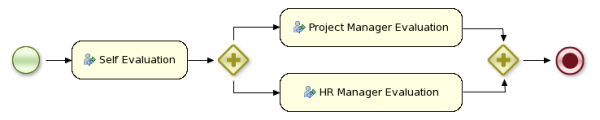

= Drools jBPM 6
:page-layout: features
:page-product_id: jbt_is 
:page-feature_id: drools-jbpm6
:page-feature_image_url: images/drools_icon_256px.png
:page-feature_highlighted: false
:page-feature_order: 10
:page-feature_tagline: A unified and integrated platform for Business Rules, Workflow and Event Processing

== Drools jBPM6

=== Model your business goals

image::images/drools-banner.png[]

A business process allows you to model your business goals by describing the steps that need to be executed 
to achieve that goal and the order, using a flow chart.  This greatly improves the visibility and agility of 
your business logic, results in higher level and domain specific representations that can be understood by 
business users and is easier to monitor.

== Workflow Engine
=== Business Process Execution

The core of jBPM is a light weight, extensible workflow engine written in pure Java that allows you to 
execute business processes using the latest BPMN 2.0 specification.  It can run in any Java environment, 
embedded in your application or as a service.

On top of the core engine, a lot of features and tools are offered to support business processes throughout 
their entire life cycle:

* Eclipse based and web based editor to support the graphical creation of your business processes (drag & drop)
* Pluggable persistence and transactions based on JPA / JTA
* Pluggable human task service based on WS HumanTask for including tasks that need to be performed by human actors
* Management console supporting process instance management, task lists and task form management, and reporting
* Optional process repository to deploy your process (and other related knowledge)
* History logging (for querying / monitoring / analysis)
* Integration with Seam, Spring, OSGi, etc.

BPM makes the bridge between business analysts, developers and end users, by offering process management 
features and tools in a way that both business users and developers like it.  Domain specific nodes can 
be plugged into the palette, making the processes more easily understood by business users.

jBPM supports adaptive and dynamic processes that require flexibility to model complex, real life situations 
that cannot easily be described using a rigid process.  We bring control back to the end users by allowing 
them to control which parts of the process should be executed, to dynamically deviate from the process, etc.

jBPM is also not just an isolated process engine.  Complex business logic can be modeled as a combination of 
business processes with business rules and complex event processing.  jBPM can be combined with the Drools 
project to support one unified environment that integrates these paradigms where you model your business 
logic as a combination of processes, rules and events.

== jBPM6
=== What's new with jBPM6?

jBPM6 is the latest community version of the jBPM project.  It is based on the BPMN 2.0 specification and 
supports the entire life cycle of the business process (from authoring through execution to monitoring and 
management).

It offers open source business process execution and management, including

* embeddable, lightweight Java process engine, supporting native BPMN 2.0 execution
* human interaction using an independent WS HT task service
* BPMN 2.0 process modeling in Eclipse (developers) and the web (business users)
* web tooling to model, deploy, execute and monitor your processes, including for example a data and form modeler, simulation, deployment, task lists, etc.
* web based business activity monitoring and reporting that allows you to define your own reports
* managing and deploying your processes using technologies underneath like Git and Maven
* an execution server that you can remotely connect to (REST, JMS) and can be deployed in a clustered environment for load balancing and high availability
* tight, powerful integration with business rules and event processing

=== So what's different?

The Drools/jBPM6 plugins have been updated to support the 6.0 version of both projects.  The wizards have 
been updated to the new API and  there is support for Drools6 and jBPM6 runtime libraries.  The jBPM plugin 
now also uses the new Eclipse BPMN2 Modeler project for editing processes using the BPMN 2.0 XML format.  
This editor does support the full BPMN 2.0 specification, and the jBPM profile now supports many new building 
blocks and properties to use when creating your business processes.
