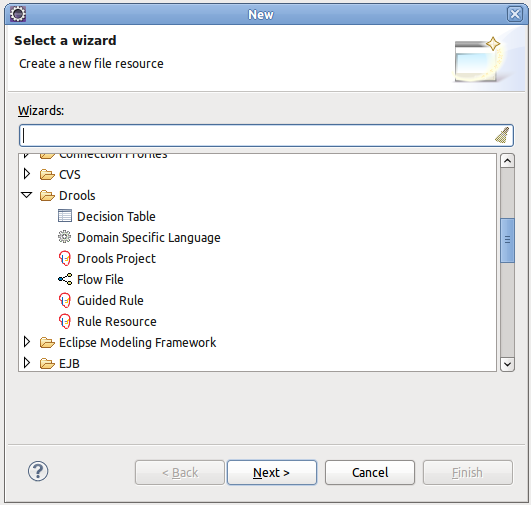
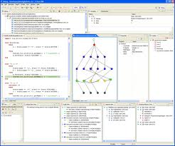

= Drools
:page-layout: features
:page-product_id: jbt_is 
:page-feature_id: drools
:page-feature_image_url: images/drools_icon_256px.png
:page-feature_highlighted: false
:page-feature_order: 10
:page-feature_tagline: Business Rules for the masses
:page-feature_deprecated: true

== Drools
=== Business Rules
image::images/features-drools-rule.jpg[Business Rule Editor]

Drools is a powerful hybrid reasoning system.  It allows you to define your business
logic using business rules in various formats (for example using decision tables etc.).

For more details, check out the http://www.jboss.org/drools[Drools home page].

== Wizards
=== Getting started

The aim of the new project wizard is to set up an executable sample project 
to start using rules immediately. This will set up a basic structure, the
classpath, sample rules and a test case to get you started.  Supports selecting
a Drools runtime for the Drools core dependencies.

== Debugging
=== Debug your processes

Debugging support to look at the current state of your session, including
the data inserted in the working memory, the rules activated, etc.  Supports
breakpoints in the rules.

== Rules Repository
=== Integration using Git

Integrate with the rules repository (as part of Guvnor, also known as
the Kie Workbench or business central) using Git tooling.

