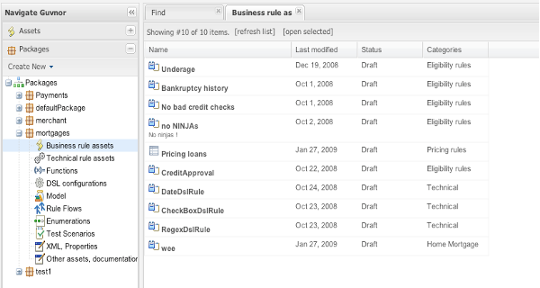

= Drools
:page-layout: features
:page-product_id: jbt_is 
:page-feature_id: drools
:page-feature_image_url: images/drools_icon_256px.png
:page-feature_highlighted: false
:page-feature_order: 10
:page-feature_tagline: Business Rules for the masses

== Drools
=== We eat rules for dinner
image::images/features-openshift-applicationwizard-reduced.png[OpenShift Application Wizard]

Blah blah

== Rule Editor
=== Edit Rules right in your IDE
image::images/features-openshift-connectiondialog-reduced.png[]

Something something

== Guvnor Package Explorer
=== Browse your repository

Control access via user defined categories (user driven groupings of artifacts, to aid quick navigation, 
including searching). These can also be used to control visibility of items (and hide features from users 
that don't need access to them).

== Guided Editor
=== Simpler rules editing

image::images/features-guvnor-dtable-511px.png[Drools/guvnor Decision Table Editor]

The guided editor provides a wizard like way to create and edit rules through a graphical interface.

