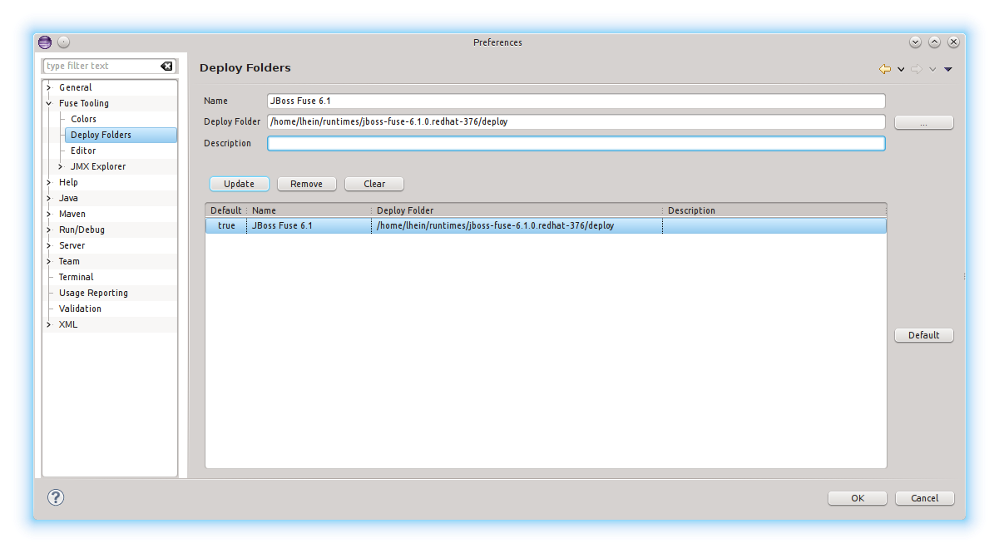

= Fabric8
:page-layout: features
:page-product_id: jbt_is 
:page-feature_id: fabric8
:page-feature_image_url: images/fuseruntimetooling_icon.png
:page-feature_highlighted: false
:page-feature_order: 10
:page-feature_tagline: Management Tools for Apache Karaf and Fabric8

== Fabric8
=== Overview

Fabric8 Tooling provides a set of developer tools that enable you to work with http://camel.apache.org[Apache Camel], http://activemq.apache.org[Apache ActiveMQ], http://cxf.apache.org[Apache CXF], http://karaf.apache.org[Apache Karaf] and http://servicemix.apache.org[Apache ServiceMix]. 
It provides a set of server adapters and enables you to manage your runtimes from inside the IDE.

== Fabric8 
=== Manage your Fabric

Use the http://fabric8.io[Fabric8] perspective to connect to your Fabric. Manage your containers and create new versions and profiles from inside your IDE. You can also access the shell of the containers in an easy way.   

== Server Adapters 
=== Download and installation made easy

Use the shipped server adapters for http://karaf.apache.org[Apache Karaf], http://servicemix.apache.org[Apache ServiceMix] and http://www.jboss.org/products/fuse[JBoss Fuse] to download and install a server onto your local machine.

== Management 
=== Manage & monitor your runtimes

Start and stop your runtimes from the Servers view, access the shell of your runtimes and monitor your runtimes via JMX.

== Deployment
=== Deploy your applications

If you want to deploy your application you can choose between multiple deployment methods. We support hotfolder deployments, deployment to a connected runtime via JMX and also deploying to a connected Fabric8 profile.
You can also choose to stop or remove your applications via JMX.
