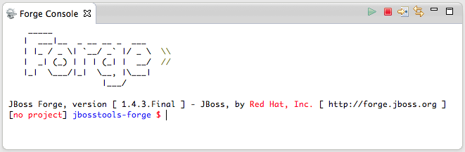

= Forge Tools
:page-layout: features
:page-product_id: jbt_core
:page-feature_id: forge
:page-feature_order: 6
:page-feature_image_url: images/jbossforge_icon_256px.png
:page-feature_tagline: Forging a bond between Command Line and IDE
:page-feature_deprecated: true
:page-issues_url: https://issues.jboss.org/browse/JBIDE/component/12313831

== Forge
=== Forging a bond between Command line and IDE
image::images/jbossforge_icon_256px.png[]

Forge integration allows developers to use the familiar terminal or command line interface within an Integrated Development Environment (IDE) using the new dedicated Forge Console. While Forge executes the user commands, the project explorer refreshes for immediate visual feedback. The Forge integration brings you the best of the two worlds in a single place. 

== Forge Console 
=== Full CLI power in your IDE

The Forge console provides access to all Forge commands via an
easy-to-use CLI. It provides contextual completion of Forge commands,
parameter names of commands, and in certain cases, values for command
parameters.

== Workspace synchronization
=== No refresh needed

Workspace synchronization ensures that any changes performed by Forge
are automatically picked up by the IDE. Newly created projects and
files are imported into Forge for further editing by the user. When
Forge adds a dependency to a project, the IDE synchronizes the project
in the workspace, adding any new libraries to ensure that the project
compiles and builds successfully. This features offers a very
tight-knit integration between Forge and the IDE.

== Forge Wizards
=== If you have a hard time remembering CLI commands

Sometimes users really don't want to type at the command line. Nevertheless
they can be very interested in using the functionality that is 
offered by Forge. For those users we have encapsulated some of the 
most useful features of Forge in nice Eclipse wizards. At this time wizards
are available to generate entities from a database, to create REST endpoints
from entities and to scaffold a user interface from entities.
