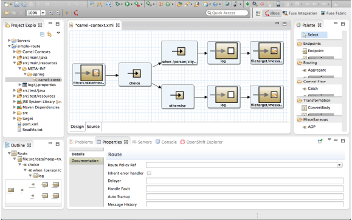

= Fuse Tooling
:page-layout: features
:page-product_id: jbt_is 
:page-feature_id: fuseide
:page-feature_image_url: images/fuse_icon.png
:page-feature_highlighted: false
:page-feature_order: 10
:page-feature_tagline: Fused Integration and Messaging

== Fuse Tooling
=== Fuse Tooling Applications

JBoss Fuse Tooling provides a set of developer tools that enable you to work with Fuse and Apache versions of 
ActiveMQ, Camel, CXF, Karaf, and ServiceMix. You can connect and configure Enterprise Integration Patterns to 
build routes, browse endpoints and routes, drag and drop messages onto running routes, trace message flows, 
edit running routes, browse and visualize runtime processes via JMX, and deploy your project's code to Red Hat 
JBoss Fuse and Fuse Fabric containers, to Apache ServiceMix, and to Apache Karaf.

== Fuse Camel Editor
=== Editing of Camel routes

 
Fuse Camel Editor provides the tools for creating a Fuse project, including the route editor, 
with its palette of supported Enterprise Integration Patterns, and the logic for running camel contexts inside 
the editor.  If you want only to create, test, and visualize routes, but not to debug them, you need install 
only the JBoss Fuse Camel Editor feature.

== Fuse Runtimes 
=== Debug Camel Routes

Allows you to debug and monitor 
camel routes running in JMX connected containers or as local processes, and to deploy camel routes to JMX connected 
containers and Fuse Fabric containers. 

== Fuse Server Extensions 
=== Control Karaf

Extends the functionality of the JBoss Fuse Camel Editor to 
allow you to configure, run, and interact with any of the supported servers via a Karaf command shell inside 
Fuse Tooling. For example, with Fuse installed on your machine, you can start it up and then create 
a fabric in which to deploy the camel routes you created with the Fuse Camel Editor.

== Feature galore
=== More is more

image::images/fuse-deploy.png[]

Fuse Tooling streamlines the process at all stages of application development:

* Creating a Maven project for your application.
The tooling loads all of the relevant Maven archetypes for creating integration projects using the Red Hat supported Apache projects.
* Adding new pieces of logic and functionality to an application.
The tooling has a wizard for creating Apache Camel context files.
* Editing the integration logic.
The tooling has a visual route editor that makes editing Apache Camel routes as easy as dragging and dropping route components.
* Testing the application.
The tooling includes testing tools that provide the full gamut of testing capabilities including:
 creating JUnit test cases for Apache Camel routes
 JMX analysis of running components
 message tracing through Apache Camel routes
* Deploying the application.
The tooling can deploy applications to a number of containers.

